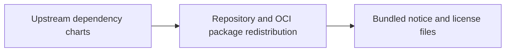

# Third-Party Notice Material

This directory contains bundled notice and license material that must travel
with the chart source or packaged chart for redistribution hygiene.

This is compliance support material, not part of the main onboarding path.

## Why this exists

## Inventory

| Path | Purpose |
| --- | --- |
| `datahub/` | Reproduced upstream DataHub `NOTICE` file |
| `gcloud-sqlproxy/` | Reproduced MIT license text for bundled `gcloud-sqlproxy` material |
| `oauth2-proxy/` | Reproduced MIT license text for bundled `oauth2-proxy` material |

## Child guides

| Path | Guide | Purpose |
| --- | --- | --- |
| `datahub/` | [datahub/README.md](datahub/README.md) | Provenance of the bundled DataHub notice |
| `gcloud-sqlproxy/` | [gcloud-sqlproxy/README.md](gcloud-sqlproxy/README.md) | Provenance of the bundled MIT license text |
| `oauth2-proxy/` | [oauth2-proxy/README.md](oauth2-proxy/README.md) | Provenance of the bundled MIT license text |

## Maintainer note

The canonical dependency inventory lives in
[../THIRD_PARTY_NOTICES.md](../THIRD_PARTY_NOTICES.md). This directory exists
for the actual notice and license files that need to ship with the chart.
