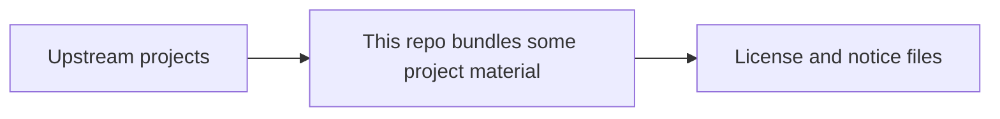

# Third-Party Notice Material

This folder contains license and notice files that must ship with the chart.

## What is in this folder

| Path | Plain meaning |
| --- | --- |
| `datahub/` | Reproduced upstream DataHub `NOTICE` file |
| `gcloud-sqlproxy/` | Reproduced MIT license text for bundled `gcloud-sqlproxy` material |
| `oauth2-proxy/` | Reproduced MIT license text for bundled `oauth2-proxy` material |

## When you can ignore this folder

Most people can ignore this folder.

You only need it when you are checking license or notice files.

## Common mistake

Do not treat this folder as the main dependency list. The main summary lives in
[../THIRD_PARTY_NOTICES.md](../THIRD_PARTY_NOTICES.md).
