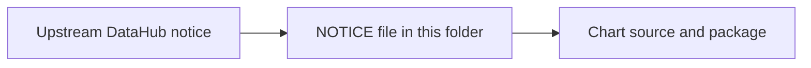

# DataHub Notice Provenance

This folder contains the upstream DataHub `NOTICE` file that ships with this
repo.

## What is in this folder

| File | Plain meaning |
| --- | --- |
| `NOTICE` | Upstream DataHub notice text bundled with the chart package |

## When you can ignore this folder

Most people can ignore this folder.

## Common mistake

If the DataHub dependency version changes, re-check the upstream `NOTICE` file
and update this copy if the upstream text changed.
