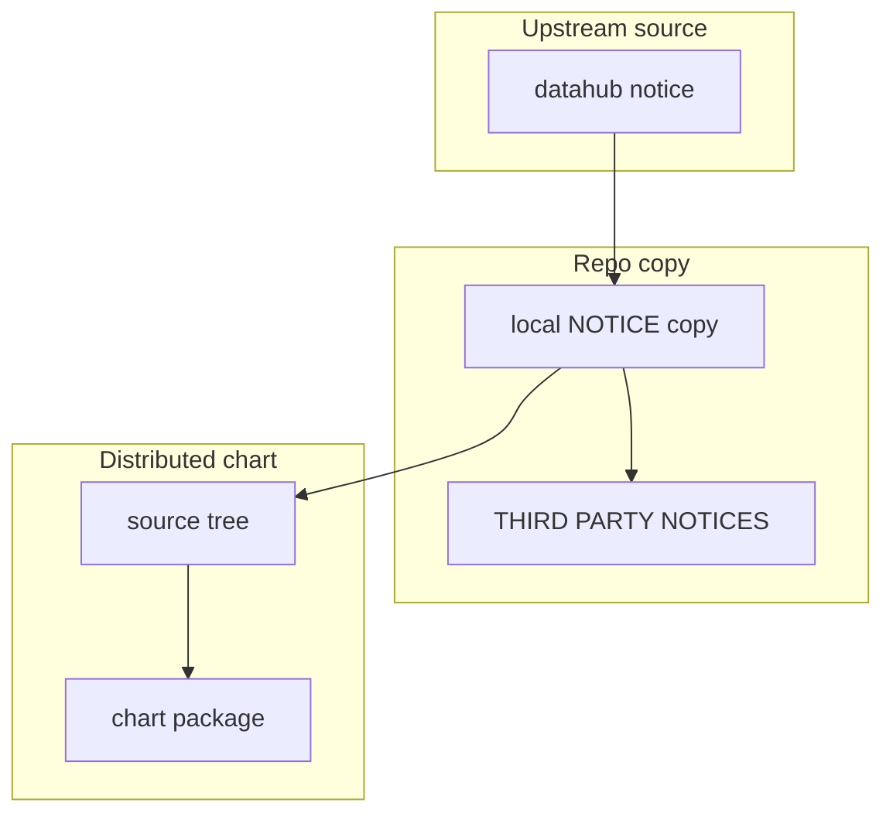

# DataHub Notice Provenance

This folder contains the copied upstream DataHub `NOTICE` file that travels
with the chart.

It exists because the chart redistributes DataHub-related material, so the repo
keeps the upstream notice text alongside the packaged source.

## Who Should Read This

| Reader | Why this guide matters |
| --- | --- |
| maintainer | to know when a DataHub dependency refresh requires a notice refresh |
| reviewer | to verify the provenance of the copied notice text |



## What Lives In This Folder

| File | Ownership | What it is for |
| --- | --- | --- |
| `NOTICE` | copied upstream notice | the DataHub notice text bundled with the chart |
| `README.md` | repo-owned guide | provenance notes for that copy |

## When This Folder Needs Attention

Review this folder when:

- the `datahub` dependency version changes
- the `datahubPrerequisites` bundle changes in a way that affects DataHub legal
  material
- `scripts/repo/license-check.sh` reports missing or stale notice coverage

The practical maintenance step is simple: compare the current upstream DataHub
`NOTICE` file with the copy in this folder and update the copy if upstream
changed.

## What Does Not Belong Here

This folder is not for:

- DataHub configuration
- DataHub deployment instructions
- API or schema docs

It is only for provenance of the bundled notice file.

## Validation

After changing this folder, run:

```bash
./scripts/license-check.sh
```

## Common Mistakes

- updating the DataHub dependency version but forgetting to review the copied
  `NOTICE`
- assuming the main notice summary file is enough without the underlying copied
  provenance file

## When You Can Ignore This Folder

Most contributors can ignore this folder unless dependency provenance is part
of the change.
