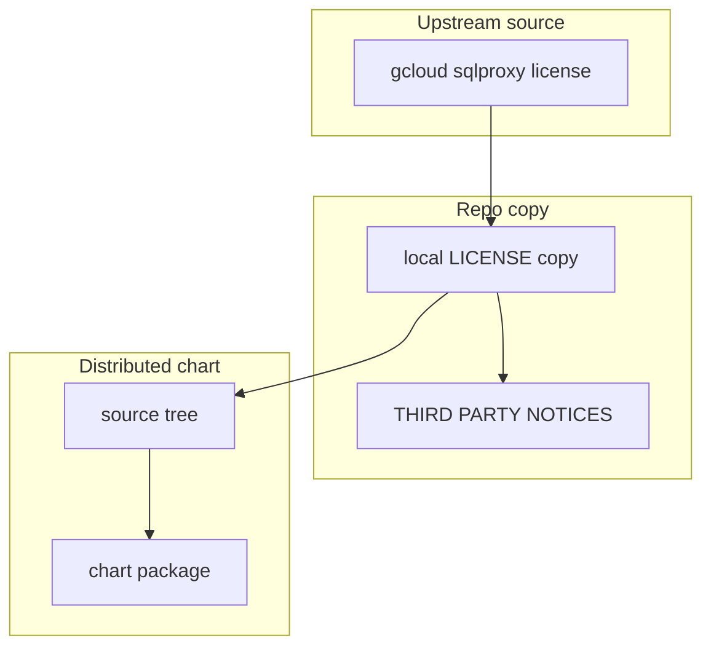

# gcloud-sqlproxy License Provenance

This folder contains the copied MIT license text for the `gcloud-sqlproxy`
material that is bundled transitively through `datahub-prerequisites`.

This is a good example of why the repo keeps a narrow provenance folder:
sometimes a legal file matters even when the component is not a top-level chart
dependency you would think about every day.

## Who Should Read This

| Reader | Why this guide matters |
| --- | --- |
| maintainer | to know why this copied license exists even though `gcloud-sqlproxy` is not a first-class top-level chart |
| reviewer | to check provenance when DataHub prerequisites change |



## What Lives In This Folder

| File | Ownership | What it is for |
| --- | --- | --- |
| `LICENSE` | copied upstream license | MIT license text for bundled `gcloud-sqlproxy` material |
| `README.md` | repo-owned guide | provenance notes for that copy |

## When This Folder Needs Attention

Review this folder when:

- `datahubPrerequisites` changes version
- the packaged DataHub prerequisites archive changes contents
- the license or notice expectations of the transitive bundle change

The key maintenance question is: does the transitive bundle still include this
component, and if so, is this still the right upstream license text?

## Validation

After changing this folder, run:

```bash
./scripts/license-check.sh
```

## Common Mistakes

- forgetting that transitive bundled components still need provenance coverage
- removing this file just because `gcloud-sqlproxy` is not configured directly
  by most users

## When You Can Ignore This Folder

Most contributors can ignore this folder unless a dependency provenance update
is in scope.
