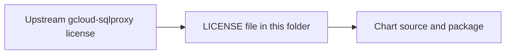

# gcloud-sqlproxy License Provenance

This folder contains the MIT license text reproduced for the bundled
`gcloud-sqlproxy` chart material that arrives through `datahub-prerequisites`.

## What is in this folder

| File | Plain meaning |
| --- | --- |
| `LICENSE` | MIT license text reproduced for bundled `gcloud-sqlproxy` material |

## When you can ignore this folder

Most people can ignore this folder.

## Common mistake

If the `datahub-prerequisites` dependency changes, confirm that the bundled
`gcloud-sqlproxy` component is still present and that its license treatment has
not changed upstream.
