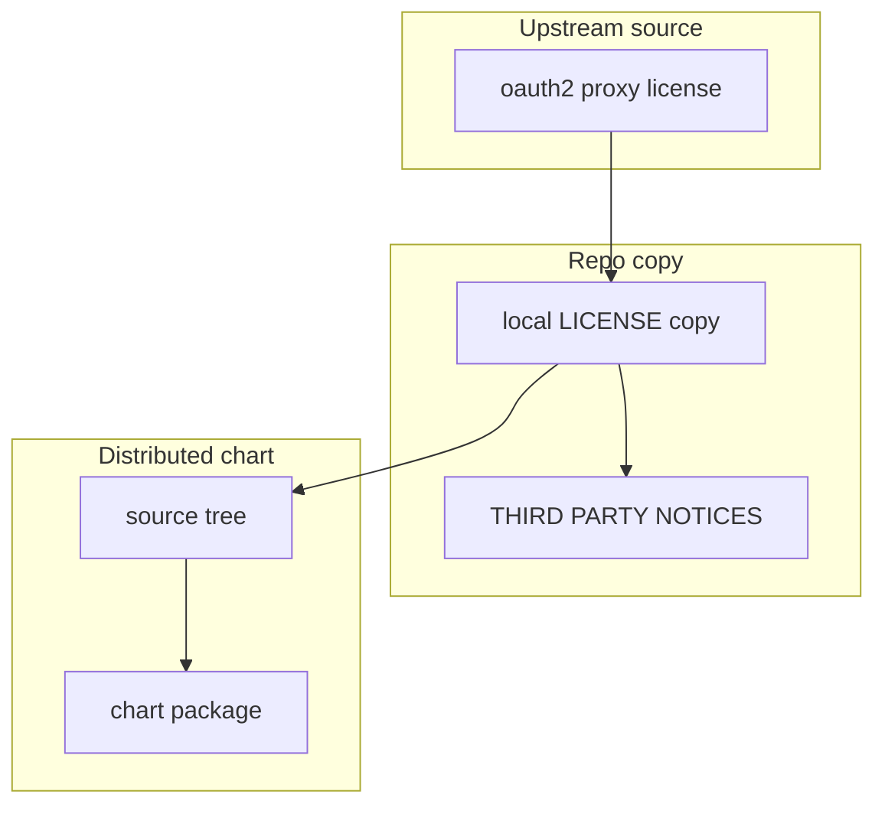

# oauth2-proxy License Provenance

This folder contains the copied upstream MIT license text for `oauth2-proxy`.

The umbrella chart redistributes `oauth2-proxy` chart material as part of the
packaged dependency bundle, so the repo keeps the license copy alongside the
chart source tree.

## Who Should Read This

| Reader | Why this guide matters |
| --- | --- |
| maintainer | to know which provenance file must be revisited when the bundled oauth2-proxy dependency changes |
| reviewer | to verify the source of the copied license text |



## What Lives In This Folder

| File | Ownership | What it is for |
| --- | --- | --- |
| `LICENSE` | copied upstream license | MIT license text for the bundled `oauth2-proxy` material |
| `README.md` | repo-owned guide | provenance notes for that copy |

## Why This One Matters In Practice

`oauth2-proxy` is not just a transitive implementation detail in this repo.

It is a major part of the platform's browser-auth boundary for:

- CloudBeaver
- Prefect
- Ranger browser access

Even so, this folder is not where the runtime behavior is documented. It is
only where the license provenance is documented.

## Update Triggers

Review this folder when:

- the bundled `oauth2-proxy` dependency version changes
- packaged dependency archives are refreshed
- `scripts/repo/license-check.sh` reports missing or stale coverage

The maintenance step is to compare the upstream project license with the copy
in this folder and update the copy if upstream changed.

## Validation

After changing this folder, run:

```bash
./scripts/license-check.sh
```

## Common Mistakes

- confusing this provenance folder with the runtime auth-proxy configuration
- updating the dependency archive but forgetting the copied license review

## When You Can Ignore This Folder

Most contributors can ignore this folder unless dependency provenance or
license compliance is part of the work.
