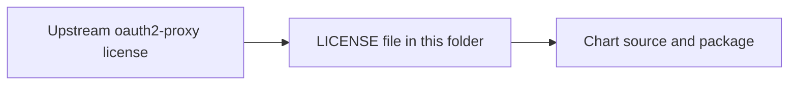

# oauth2-proxy License Provenance

This folder contains the reproduced MIT license text for the upstream
`oauth2-proxy` project.

## Why it is here

The umbrella chart redistributes the `oauth2-proxy` Helm chart archive as part
of the chart package, so the repo keeps the upstream MIT license text
alongside it.

## What is in this folder

| File | Plain meaning |
| --- | --- |
| `LICENSE` | The upstream MIT license text for `oauth2-proxy` |

## Upstream source reviewed

- Project: `https://github.com/oauth2-proxy/oauth2-proxy`
- License text: `https://github.com/oauth2-proxy/oauth2-proxy/blob/master/LICENSE`

## When you can ignore this folder

Most people can ignore this folder.
