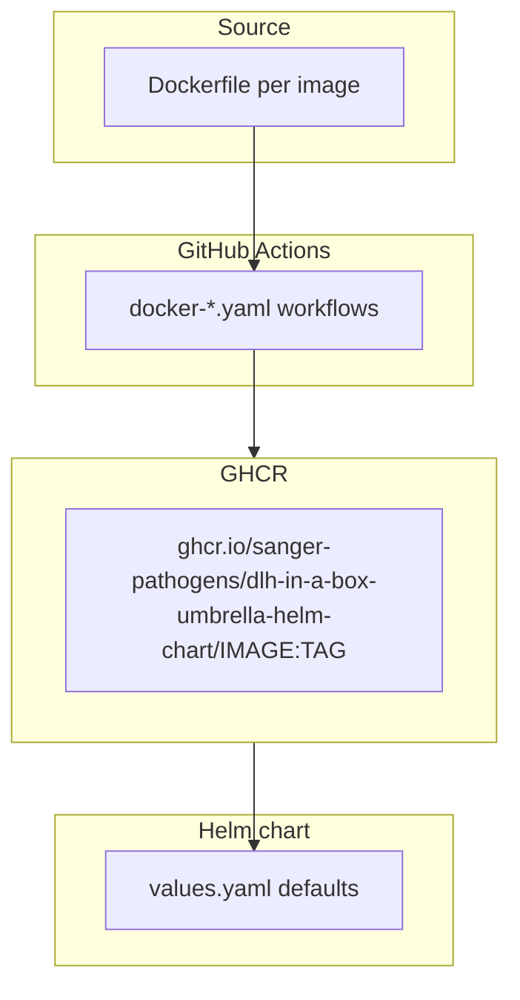

# Docker Images

This folder contains the Dockerfiles for custom images built and published as
part of this repository.

Images are built by GitHub Actions and pushed to GHCR under the repository
path so they are automatically linked to this repo.

## Who Should Read This

| Reader | Why this guide matters |
| --- | --- |
| maintainer | to understand how custom images are built and where they are published |
| contributor | to know where to make changes when a base image or driver version needs updating |
| operator | to understand why chart defaults point to GHCR rather than Docker Hub |

## What Lives In This Folder

| Folder | Image | Purpose |
| --- | --- | --- |
| `hive-metastore/` | `hive-metastore:4.2.0` | Apache Hive 4.2.0 with PostgreSQL JDBC driver |

## Adding a New Image

- create a subfolder with a `Dockerfile` and a `README.md`
- add a matching `docker-<name>.yaml` workflow under `.github/workflows/`
- update chart defaults to reference the new image