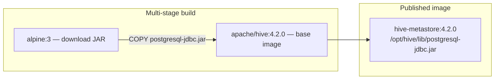

# hive-metastore image

Apache Hive 4.2.0 standalone metastore with the PostgreSQL JDBC driver
pre-installed.

The official `apache/hive:4.2.0` image does not ship with the PostgreSQL JDBC
driver. This image adds `postgresql-42.7.4.jar` to `/opt/hive/lib/` so the
metastore can connect to a PostgreSQL backend without any runtime downloads or
init-container workarounds.

## Who Should Read This

| Reader | Why this guide matters |
| --- | --- |
| maintainer | to know how to update the Hive or JDBC driver version |
| operator | to understand why the chart defaults reference this image instead of the upstream one |

## Updating versions

To update the **Hive base version**, change the `FROM apache/hive:X.Y.Z` line
and update all `4.2.0` references in this directory, the workflow, and the
chart values.

To update the **JDBC driver version**, change the `curl` URL in the Dockerfile
and update the filename if the version appears in it.