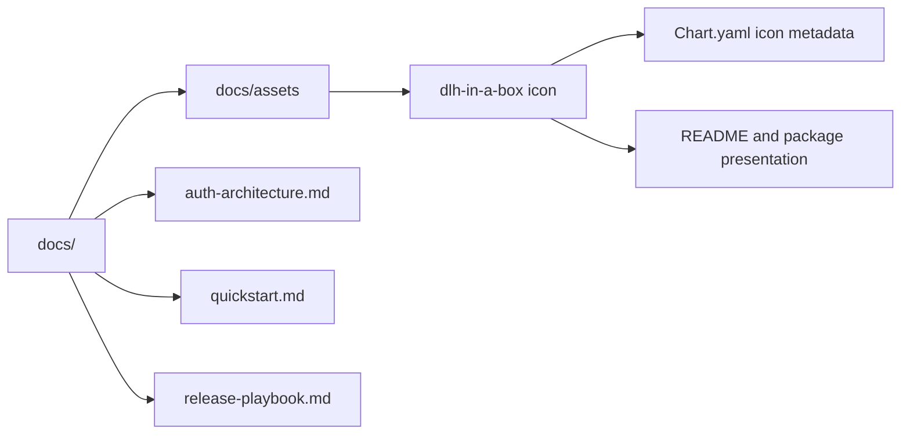

# Documentation

This directory holds repository-owned onboarding, release, and static
documentation assets.

## Current structure

## Child guide

| Path | Guide | Purpose |
| --- | --- | --- |
| `quickstart.md` | [quickstart.md](quickstart.md) | First-run onboarding for new consumers |
| `auth-architecture.md` | [auth-architecture.md](auth-architecture.md) | Shared identity, groups, and access-control design |
| `release-playbook.md` | [release-playbook.md](release-playbook.md) | Release and publication runbook |
| `assets/` | [assets/README.md](assets/README.md) | Static icons and future documentation assets |

## Maintainer note

This directory is where narrative documentation should live when it is too long
or too operational to belong in the root README or chart README.
