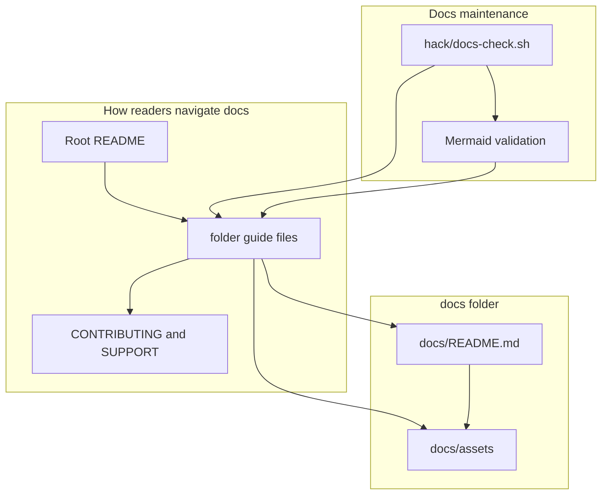

# Documentation Guide

This folder contains the small amount of shared documentation support material
that is still left in the repo.

That sentence is important: the main documentation does not live here anymore.
The main documentation lives next to the code and folders it describes.

## Who Should Read This

| Reader | Why this guide matters |
| --- | --- |
| contributor | to understand why `docs/` is intentionally small |
| maintainer | to know what belongs here versus in folder-local guides |
| doc editor | to understand the difference between public support material and internal review notes |



## What Lives In This Folder

| Path | What it is for |
| --- | --- |
| `README.md` | explains the reduced role of `docs/` |
| `assets/` | shared image and icon files used by docs or chart metadata |
| `architecture/` | IcePanel model source, publication companion text, and exported architecture diagrams |
| `Internal/` | internal review material and audit notes, not part of the public folder-guide scope |
| `release-agent-playbook.md` | pointer to the reusable release skill under `skills/release-agent/` |

## Why This Folder Is Small

Earlier versions of the repo treated `docs/` as a more central home for
explanations.

The current guide system deliberately moved explanations closer to the folders
they describe. That means:

- chart behavior is explained under `charts/dlh-in-a-box/`
- example behavior is explained under `examples/`
- script behavior is explained under `scripts/`

`docs/` now only holds the shared residue that still makes sense centrally.

## What Belongs Here

Good fits for this folder:

- shared assets used across documentation
- shared architecture artifacts used for publication and review
- very small cross-cutting support material
- internal review notes that should not become part of the public folder-guide
  contract

Poor fits for this folder:

- chart logic explanations
- example overlay explanations
- workflow explanations
- large onboarding guides that belong next to source code

## About `docs/Internal/`

`docs/Internal/` exists and matters, but it is intentionally not treated like a
public folder guide target.

Use it as:

- an audit input
- a place for review notes
- a place to capture critique or work-in-progress thinking

Do not assume it is part of the public newcomer path.

## Validation

If you change the public docs support material here, run:

```bash
./scripts/docs-check.sh
```

## Common Mistakes

- putting deep code explanations under `docs/` instead of next to the code
- treating `docs/Internal/` as public user-facing guidance

## When You Can Ignore This Folder

You can ignore this folder if you are:

- trying the chart
- choosing an example file
- working on chart logic
- working on scripts or workflows

In those cases, read the guide in the folder you are actually using.
