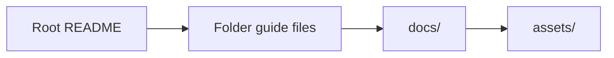

# Documentation Guide

This folder contains the small amount of shared documentation support material
that is still left in the repo.

The main documentation does not live here anymore.

Every important folder now explains itself with its own guide file.

## What is in this folder

| File or folder | Plain meaning |
| --- | --- |
| `README.md` | This short explanation of what `docs/` is now |
| `assets/` | Shared images and icon files used by the docs or chart metadata |

## When you can ignore this folder

You can ignore this folder if you are:

- trying the chart
- choosing an example file
- working on chart logic
- working on scripts or workflows

In those cases, read the guide file in the folder you are actually using.
