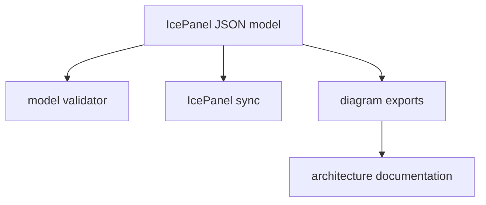

# DLH-in-a-box Architecture Model

This folder contains the IcePanel model for the `dlh-in-a-box` umbrella Helm
chart and the publication-facing companion description.

The canonical model source is:

```text
docs/architecture/icepanel/models/dlh-in-a-box.json
```

Use the Markdown file as explanatory documentation for reviewers and article
authors. Do not treat it as the sync source of truth.



## Files

| Path | Purpose |
| --- | --- |
| `icepanel/models/dlh-in-a-box.json` | Canonical IcePanel-as-code model source. |
| `icepanel/models/dlh-in-a-box.schema.json` | JSON schema for the model file. |
| `dlh-in-a-box-icepanel-model.md` | Publication-readable companion model description. |
| `local-kubernetes-docker-deployment.puml` | PlantUML deployment diagram for a laptop install using Docker, kind, Kubernetes, and Helm. |
| `local-kubernetes-docker-deployment.svg` | Rendered SVG version of the local Docker/Kubernetes deployment diagram. |
| `sync_dlh_icepanel.py` | Dry-run/apply synchronisation into IcePanel. |
| `validate_dlh_icepanel_json.py` | Local JSON schema and semantic validator. |
| `export_dlh_icepanel_diagrams.py` | Exports official dark-mode diagram PNGs. |
| `icepanel/exports/dlh-in-a-box/png-dark/` | Exported dark-mode PNG files for the official diagrams. |

## IcePanel Group Rule

IcePanel groups must contain their member objects in the model. Do not only
draw a visual group around objects on the canvas. The JSON `groups` field is
used by `sync_dlh_icepanel.py` to set IcePanel `groupIds`, so each grouped item
is actually assigned to the group in IcePanel.

## Reality Links

Objects that correspond to repository content use the JSON `links` field to
point at GitHub `main` branch files or folders. The sync script translates those
URLs into IcePanel reality links by using IcePanel's URL resolver.

## Commands

Set `ICEPANEL_API_KEY` in your shell, or place it in a local `.env` file that is
not committed.

```bash
python3 docs/architecture/validate_dlh_icepanel_json.py
python3 docs/architecture/sync_dlh_icepanel.py
python3 docs/architecture/sync_dlh_icepanel.py --apply
python3 docs/architecture/sync_dlh_icepanel.py --apply --update-layout
python3 docs/architecture/export_dlh_icepanel_diagrams.py
```

The sync command is dry-run by default. A clean dry-run should report
`No changes required`. Use `--update-layout` only when the JSON layout is being
intentionally reapplied to IcePanel; it resets official diagram object
positions from the source model. The PNG export defaults to 1800 px wide dark
mode images, which are intended to remain readable when inserted into a
document page.

## Model Scope

This folder owns the architecture model for the reusable Helm chart product and
the runtime it deploys. Deployment-repository architecture that belongs to
`icddrb-data-platform-infra` should remain in that repository.
