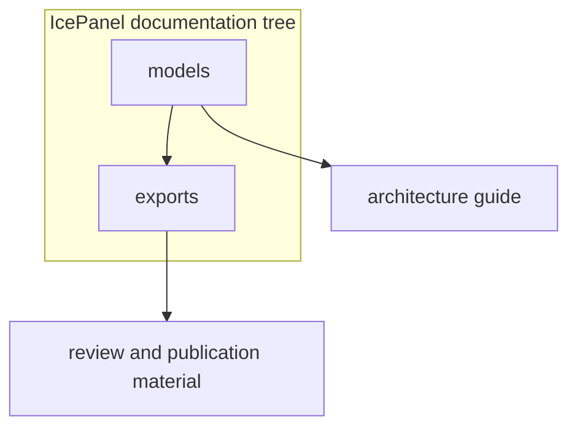

# IcePanel Architecture Source

This folder contains the IcePanel source model and exported diagram artifacts
for the `dlh-in-a-box` architecture documentation.

## Folder Map

| Path | Purpose |
| --- | --- |
| [models/](models/) | Canonical IcePanel JSON model and schema. |
| [exports/](exports/) | Generated diagram exports derived from the model. |

## Maintenance

Keep this folder aligned with [the architecture guide](../README.md). The JSON
model is the source of truth; exported images and PDFs should be regenerated
from that model instead of edited by hand.
