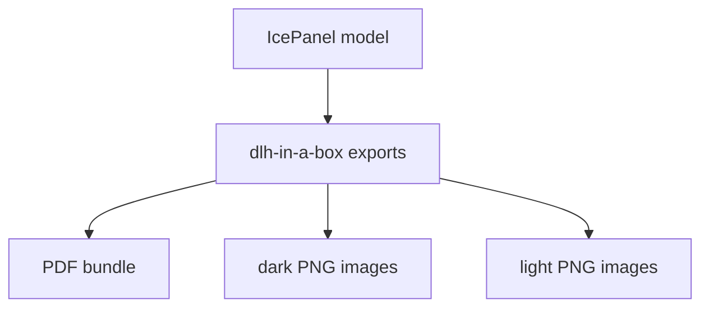

# IcePanel Diagram Exports

This folder stores generated diagram artifacts from IcePanel model exports.

## Folder Map

| Path | Purpose |
| --- | --- |
| [dlh-in-a-box/](dlh-in-a-box/) | Diagram exports for the `dlh-in-a-box` model. |

## Maintenance

Treat these files as generated documentation artifacts. When the model changes,
regenerate the exports with the architecture export tooling rather than
manually editing the exported files.
