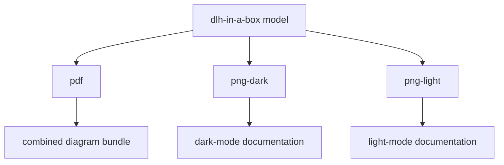

# DLH-in-a-box Diagram Exports

This folder groups the exported diagrams for the `dlh-in-a-box` IcePanel model.

## Folder Map

| Path | Purpose |
| --- | --- |
| [pdf/](pdf/) | Combined PDF bundle of the exported diagrams. |
| [png-dark/](png-dark/) | Dark-mode PNG exports for each official diagram. |
| [png-light/](png-light/) | Light-mode PNG exports for each official diagram. |

## Maintenance

Keep the PDF and PNG sets synchronized with
[the model source](../../models/). A complete refresh should update all export
formats together so reviewers can choose the format that fits their document or
presentation workflow.
