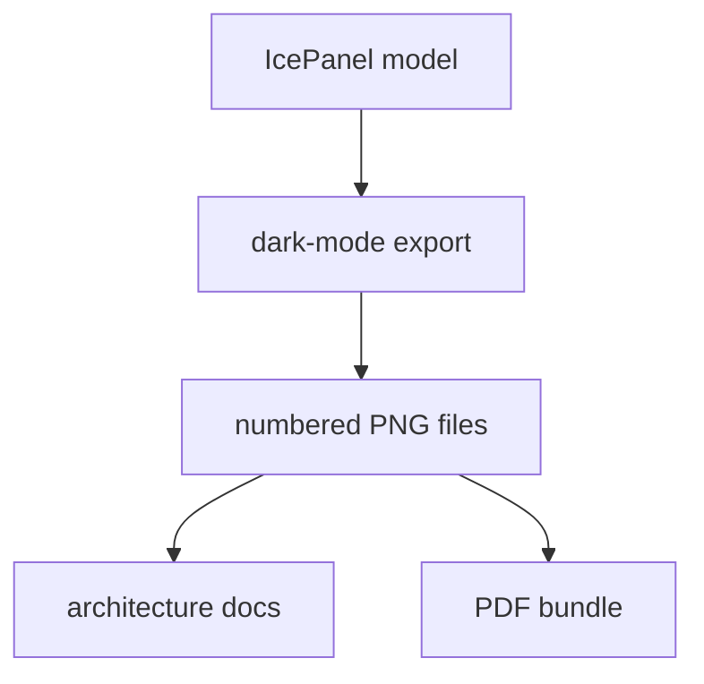

# DLH-in-a-box Dark PNG Diagrams

This folder contains dark-mode PNG exports for the official `dlh-in-a-box`
IcePanel diagrams.

## Files

The numbered PNG files correspond to the official IcePanel diagram order. Keep
the filenames stable unless the model diagram sequence changes intentionally.

## Maintenance

Use these images where a dark background or high-contrast rendered diagram is
preferred. Regenerate the full set together so the numbering and visual style
remain consistent.
