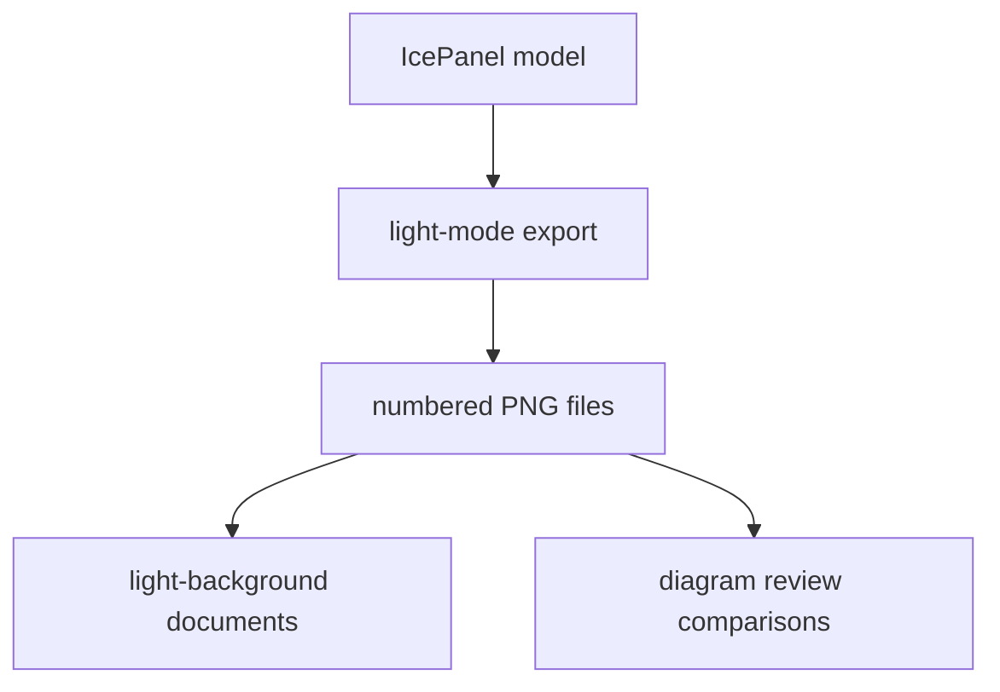

# DLH-in-a-box Light PNG Diagrams

This folder contains light-mode PNG exports for the official `dlh-in-a-box`
IcePanel diagrams.

## Files

The numbered PNG files correspond to the official IcePanel diagram order. Keep
the filenames stable unless the model diagram sequence changes intentionally.

## Maintenance

Use these images where a light document background is preferred. Regenerate the
full set together so the light and dark export folders stay aligned.
