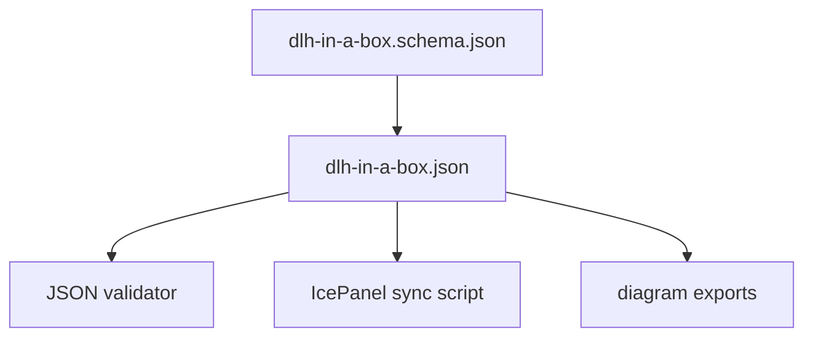

# IcePanel Model Files

This folder contains the canonical IcePanel-as-code model for the
`dlh-in-a-box` architecture and the JSON schema used to validate it.

## Files

| File | Purpose |
| --- | --- |
| [dlh-in-a-box.json](dlh-in-a-box.json) | Canonical model source. |
| [dlh-in-a-box.schema.json](dlh-in-a-box.schema.json) | Schema for the model file. |

## Maintenance

Edit the model source first, validate it with the architecture validation
script, and then regenerate exports from the validated model.
