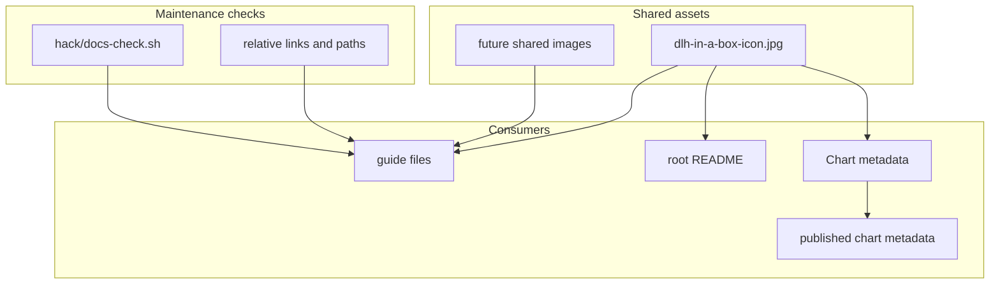

# Documentation Assets

This folder contains shared image files used by the docs or chart metadata.

It is intentionally small and mostly static.

## What Lives In This Folder

| File | What it is for |
| --- | --- |
| `dlh-in-a-box-icon.jpg` | logo/icon image with platform title, referenced by `charts/dlh-in-a-box/Chart.yaml`, the root `README.md`, and chart metadata |

## How This Folder Fits Into The Repo

This folder is not an art library for the platform UI.

It currently exists to support:

- chart metadata
- documentation presentation

The important boundary is that UI behavior and styling mostly live in chart
templates, not here.

## When To Edit This Folder

Edit this folder when:

- the chart icon changes
- a shared documentation image needs to be added

If you add new assets, document:

- who uses them
- where they are referenced
- whether they need any matching path updates

## Validation

After changing assets here:

- update any references in Markdown or `Chart.yaml`
- run `make docs-check`

## Common Mistakes

- renaming the icon without updating `charts/dlh-in-a-box/Chart.yaml`
- storing product UI assets here when they actually belong in chart templates

## When You Can Ignore This Folder

Most people can ignore this folder.

You only need it when changing shared doc or chart-metadata images.
