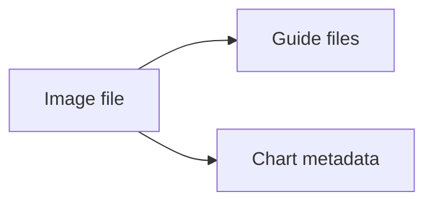

# Documentation Assets

This folder contains shared image files used by the docs or chart metadata.

## What is in this folder

| File | Plain meaning |
| --- | --- |
| `dlh-in-a-box-icon.jpg` | The icon used by the chart metadata |

## When you can ignore this folder

Most people can ignore this folder.

You only need it when you are changing the chart icon or another shared image.

## Common mistake

If you rename or replace the icon, also update the matching path in
[`../../charts/dlh-in-a-box/Chart.yaml`](../../charts/dlh-in-a-box/Chart.yaml).
