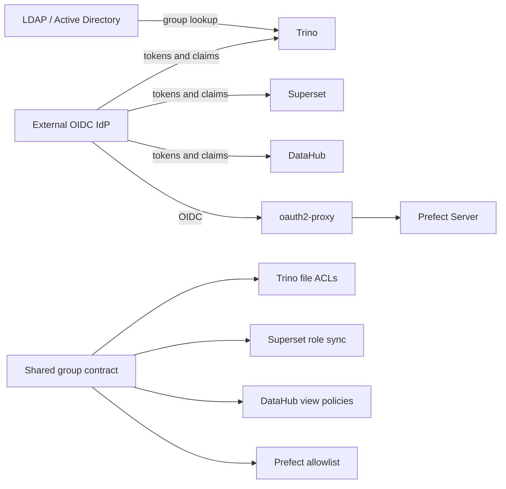
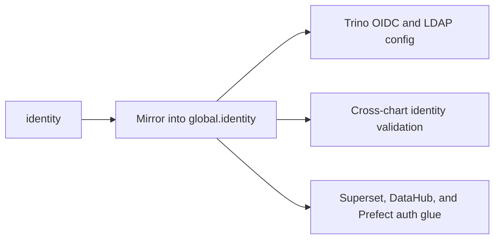
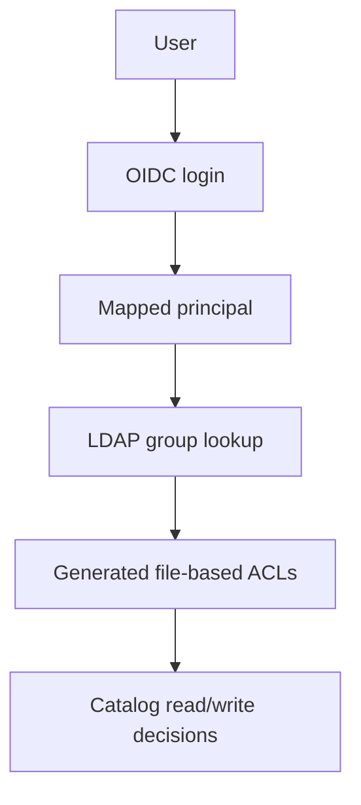
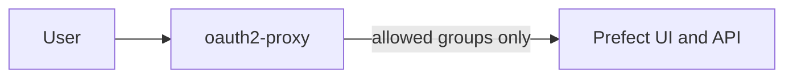
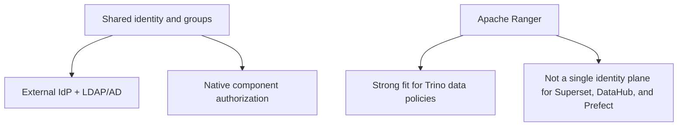

# Identity and Access Architecture

This guide describes the phase-1 shared identity design for `dlh-in-a-box`.

The goal is one institutional source of truth for users and groups, reused
across Trino, Superset, DataHub, and Prefect without creating local
application-specific accounts.

## Architecture summary



## Group model

The chart uses three group classes:

- app access groups such as `dlh-app-trino`, `dlh-app-superset`, `dlh-app-datahub`, and `dlh-app-prefect`
- persona groups such as `dlh-role-scientist`, `dlh-role-analyst`, and `dlh-role-data-engineer`
- data access groups such as `dlh-data-<domain>-ro` and `dlh-data-<domain>-rw`

These are intentionally separate. App access answers "who may open this tool?"
while data access answers "what may they see or change once inside?"

## Identity assumptions

- The external OIDC principal and the LDAP or AD username used by Trino group
  resolution must represent the same human identity.
- In practice this means the OIDC `usernameClaim` and the LDAP
  `userSearchFilter` need to converge on the same institutional username or
  email-derived identifier.
- If those identifiers drift, Trino authentication may succeed while LDAP
  group lookup returns the wrong subject or no groups at all.

## Values projection

The chart keeps the shared identity contract readable by separating the
human-facing declaration from the runtime copy consumed by subcharts.



The reference overlay uses a YAML anchor so `identity` stays the single place
where maintainers edit OIDC, LDAP, and group-contract details:

```yaml
identity: &identity
  enabled: true
  external:
    oidc:
      issuer: https://login.example.org/realms/dlh
      # ...

global:
  identity: *identity
```

## Component behavior

### Trino



- OIDC handles authentication.
- LDAP or AD resolves groups for the authenticated principal.
- The umbrella chart generates Trino file-based access rules from
  `global.dataCatalogs.*.authorizedGroups`.
- `authorizedUsers` still renders for backward compatibility, but group-based
  rules are the preferred model.

### Superset

- Superset uses OIDC through `configOverrides`.
- External groups are mapped onto Superset roles, then re-synced at login.
- Because the upstream chart does not project the OIDC client credentials from
  the shared identity block automatically, `superset.extraEnvRaw` must provide
  `OAUTH_CLIENT_ID` and `OAUTH_CLIENT_SECRET`.
- App-level access is typically driven by `dlh-app-superset`.
- Elevated author or admin access is typically driven by
  `dlh-role-data-engineer`.

### DataHub

- DataHub frontend OIDC is configured through the upstream chart values.
- The shared identity contract is validated against
  `datahub.datahub-frontend.oidcAuthentication` so the client ID and secret
  reference stay aligned.
- Group-aware visibility should be expressed through DataHub policies keyed off
  the same external groups used elsewhere.
- The umbrella chart documents and scaffolds the group provisioning contract,
  but the final policy shape remains a DataHub-native concern.

### Prefect



- Self-hosted Prefect does not provide the same native RBAC and SSO story as
  the other components.
- Phase 1 therefore protects Prefect with `oauth2-proxy` and group allowlists.
- When using an externally managed secret for the proxy, that Secret must
  expose `client-id`, `client-secret`, and `cookie-secret` for the upstream
  chart.
- This controls who may reach Prefect at all, but it does not pretend to offer
  in-app role separation that the upstream open-source product does not expose.

## Why phase 1 does not use Apache Ranger



Apache Ranger remains a valid phase-2 option if you later want a dedicated
Trino policy administration surface, richer audit trails, row filters, or
column masking outside Helm-managed policy files.

The phase-1 recommendation keeps the identity source external and uses the
native authorization mechanisms each component already understands.

## Shared-environment validation checklist

Use [../examples/values-shared-auth.yaml](../examples/values-shared-auth.yaml)
as the reference overlay, then verify the following personas before promoting
the pattern into a shared cluster.

| Persona | Expected access |
| --- | --- |
| Scientist | Can authenticate to Trino, Superset, and DataHub. Cannot reach Prefect. |
| Analyst | Can authenticate to Trino, Superset, and DataHub, but only sees the domains covered by their `dlh-data-*` groups. |
| Data engineer | Can authenticate to Trino and DataHub and is allowed through the Prefect proxy. Elevated Superset or engineering roles are optional and group-driven. |

Acceptance check:

- change one user in the external directory from one group set to another
- force a fresh login where needed
- confirm Trino catalog access, Superset role mapping, DataHub visibility, and
  Prefect reachability all change without creating or editing local
  application-specific users

## Values map

| Values path | Responsibility |
| --- | --- |
| `identity` | Human-facing shared identity declaration |
| `global.identity` | Runtime copy consumed by subcharts |
| `global.dataCatalogs.*.authorizedGroups` | Preferred Trino catalog ACL source |
| `superset.auth.roleMappings` | External group to Superset role mapping |
| `datahub.auth.groupProvisioning` | DataHub-facing group contract and policy scaffold |
| `prefect.authProxy` | Feature toggle for Prefect protection |
| `prefect-auth-proxy` | Direct oauth2-proxy chart values |

## Reference overlay

[../examples/values-shared-auth.yaml](../examples/values-shared-auth.yaml) is
the shared-environment starting point for this model. It is intentionally
render-validated documentation rather than a disposable local demo, so it
expects real ingress hosts, externally created Secrets, and a live OIDC plus
LDAP or AD integration path.
