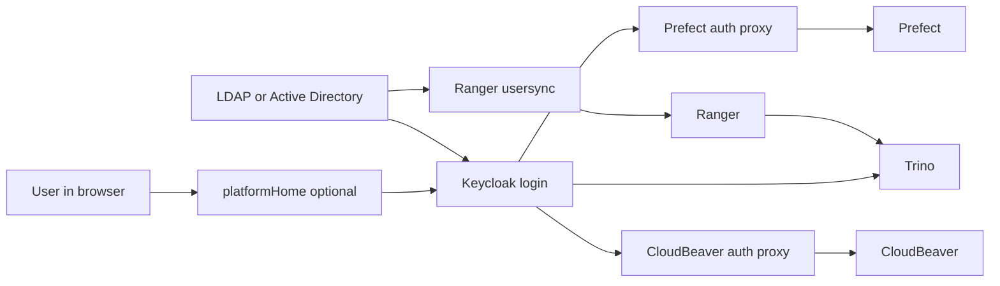

# Identity And Access Architecture

This guide explains how login and access work in the chart.

You do not need to know every tool already. The simple version is:

- Keycloak handles login
- a directory can supply users and groups
- Ranger stores access rules
- Trino is the SQL engine those rules protect

## Supported Identity Modes

There are two main ways the chart can handle users:

| Mode | Simple meaning |
| --- | --- |
| `externalLdap` | Users sign in through Keycloak, but the real user list and groups come from LDAP or Active Directory |
| `keycloakLocal` | Keycloak stores the users itself |

## Default Model

The shared development and production examples in this repository use
`externalLdap`.

What that means in plain language:

- the user signs in once through Keycloak
- the user’s groups usually come from LDAP or Active Directory
- Ranger stores the access rules
- Trino is the main data-query tool those rules affect
- browser tools such as Prefect and CloudBeaver can reuse the same sign-in

## Keycloak Local Users Model

`keycloakLocal` means Keycloak stores the users itself.

Use this when you do not want to connect to LDAP or Active Directory.

That mode is shown in `examples/values-local-auth.yaml`.

In this mode:

- users are created in Keycloak
- self-registration can be turned on
- Ranger usersync stays off
- the LDAP-focused admin page in `platformHome` stays hidden

## Development Versus Production

Here is how the example files in this repository map to login modes:

| File | What it is for | Identity mode |
| --- | --- | --- |
| `examples/values-local.yaml` | Simplest local install | No shared identity setup |
| `examples/values-local-auth.yaml` | Local auth test | `keycloakLocal` |
| `examples/values-dev.yaml` | Shared dev example | `externalLdap` |
| `examples/values-prod.yaml` | Shared prod-shaped example | `externalLdap` |
| `examples/values-shared-auth.yaml` | Shared example with external OIDC provider | `externalLdap` plus external OIDC provider |

## Username And Group Alignment

This is the most important rule in the whole auth setup:

all parts of the system need to agree on who the user is.

That means the same person should look the same to:

- Keycloak
- LDAP or Active Directory
- Ranger
- Trino

If those names do not line up, login can work but access can still be wrong.

## Trino

Trino is the tool that actually runs SQL queries.

There are three different questions around Trino access:

- who is this user?
- what groups or roles does this user have?
- what data is this user allowed to read or change?

In this chart:

- shared dev and prod examples currently use generated file-based rules inside
  Trino
- Ranger can also be used inside Trino, but only if
  `global.authorization.ranger.trino.enabled=true` and the Trino image has the
  Ranger plugin built in
- long-lived access should normally be modeled through
  `global.authorization.platformRoles`

In `externalLdap` mode, users can reach Trino through:

- browser login
- token-based clients
- optional LDAP password auth if it is turned on

In `keycloakLocal` mode, the normal user path is token-based:

- browser login
- token-capable desktop or code clients
- optional direct-grant token exchange
- optional JupyterHub notebooks reusing the Keycloak token

## Platform Roles And Direct-User Exceptions

The chart has a concept called a platform role.

In simple terms, a platform role is a named bundle of access.

Use platform roles for the normal, long-term access model.

If one person needs temporary extra access, use an exception role instead of
changing the normal baseline role for everyone.

## Browser Apps And Admin Surfaces

Several browser apps can share the same login story:

- `platformHome`
  Optional browser home page
- `Prefect`
  Browser workflow UI
- `CloudBeaver`
  Browser SQL UI
- `JupyterHub`
  Optional notebook UI

CloudBeaver needs one extra note:

- browser login goes through the auth proxy and Keycloak
- the saved database connection can be pre-seeded by admins
- that saved connection might use a shared service account
- the chart does not assume every CloudBeaver user types an LDAP password
  directly into Trino

## Prefect

Prefect is put behind `oauth2-proxy` so it can use the same login system as
the rest of the platform.

That means:

- the browser sign-in goes through Keycloak
- group-based access checks happen at the proxy
- optional machine-token access can also be enabled if needed

## Browser URLs Versus In-Cluster URLs

The chart often needs two kinds of URLs:

- a browser URL that a human can open
- an internal cluster URL that one service uses to talk to another service

Those are not always the same thing.

## LDAPS Trust Material

If you use secure LDAP, the chart needs certificate trust settings so the
services know which LDAP certificate to trust.

The main values involved are:

- `global.identity.directory.ldap.trustedCaExistingSecret`
- `keycloak.trustedCertsExistingSecret`

## What The Chart Enforces

The chart checks some things for you:

- required identity settings are present
- incompatible auth modes are rejected
- Prefect auth proxy settings line up
- governed datasets carry the required metadata

## What Operators Still Need To Do

The chart does not do everything for you.

You still need to:

- create the real Secrets
- choose the real usernames and groups
- connect to the real LDAP or Active Directory system if you use one
- test real sign-in and real access in a cluster

## Related Docs

- [glossary.md](glossary.md)
- [data-governance.md](data-governance.md)
- [../examples/README.md](../examples/README.md)
