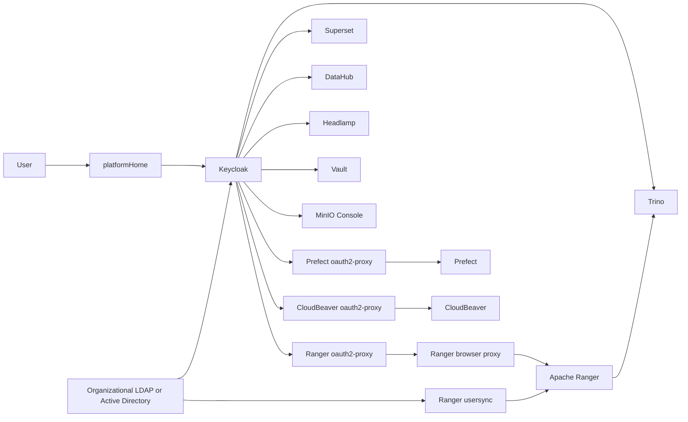
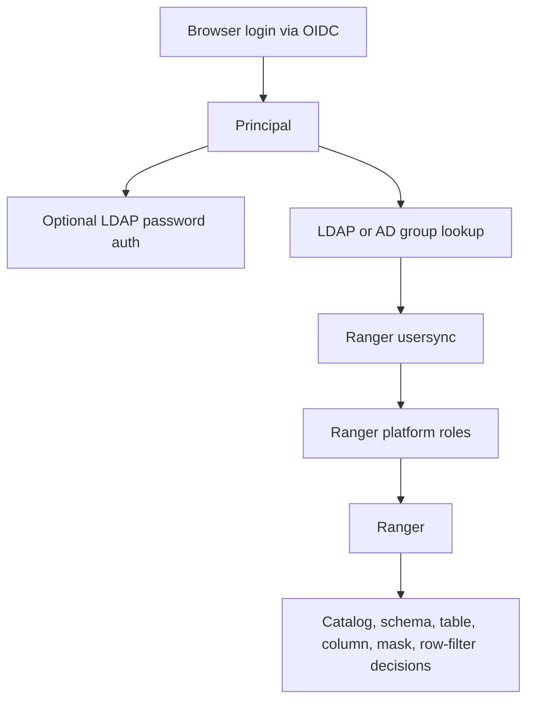
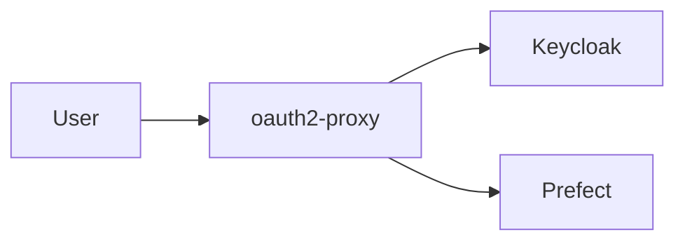
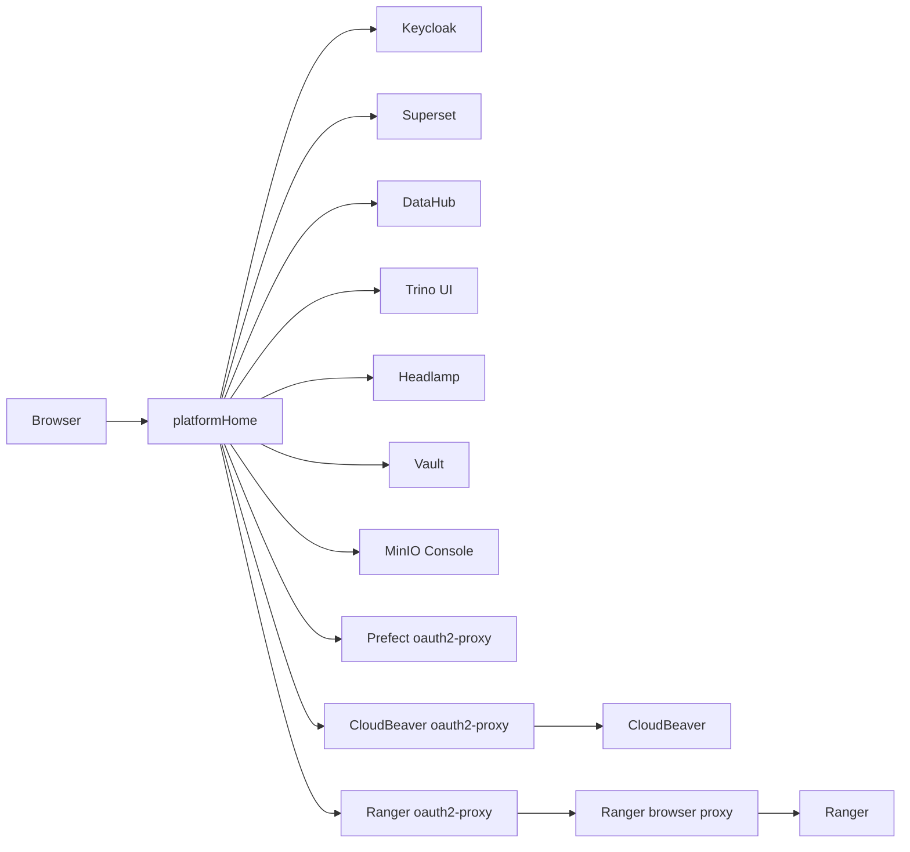
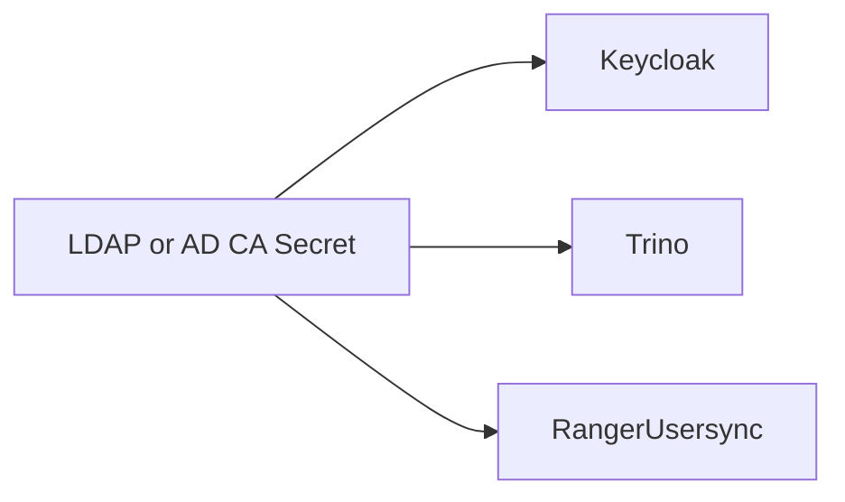

# Identity And Access Architecture

This guide explains the default identity and access model for shared
environments.

It is written for chart consumers and maintainers who need to understand how
Keycloak, LDAP/AD, Trino, Ranger, and Prefect fit together.

## Default Model

In plain English:

- Keycloak handles browser login.
- LDAP or AD remains the source of users and groups.
- Platform roles provide the Git-managed abstraction between directory subjects
  and Ranger policies.
- `platformHome` is the browser launchpad, not an iframe container.
- Ranger holds the Trino data-access rules.
- Prefect, CloudBeaver, and Ranger are protected at the front door by
  `oauth2-proxy`.

## Why Keycloak Is The Default

Keycloak gives the platform one OIDC issuer across Trino, Superset, DataHub,
and Prefect access. That means the institution does not need a separate OIDC
product just to make the platform work.

If an institution already has another preferred OIDC provider, the chart can
still use it. That path remains supported, but it is no longer the primary
documented architecture.

## Development Versus Production

| Environment | Identity source | Group source | Notes |
| --- | --- | --- | --- |
| Development | Bundled Keycloak | External organizational LDAP/AD | Keeps development aligned with the real identity source instead of inventing an in-cluster directory |
| Production | Bundled Keycloak | External AD/LDAP over LDAPS | Matches the institutional source of truth while keeping one platform OIDC issuer |

Temporary bring-up exception:

- in `local` or `dev`, bundled Keycloak can also seed a very small set of
  `bootstrapUsers`
- this is only for browser-session validation while real LDAP or AD details are
  still pending
- when that fallback is active, Ranger LDAP usersync must stay off and Trino
  LDAP password auth must stay off
- it is not allowed in `prod`

## Username And Group Alignment

The most important rule in this design is identity alignment.

The following must all refer to the same person:

- the principal inside the OIDC token
- the username used for LDAP or AD lookup
- the subject Ranger policies evaluate

If those identifiers drift apart, users can log in successfully but receive
the wrong groups or no groups at all.

For browser-facing apps and auth proxies, prefer:

- a stable username claim such as `preferred_username`
- a filtered platform-scoped groups claim rather than the full institutional
  group universe

That keeps headers smaller, avoids browser-proxy drift, and makes launcher or
app authorization decisions easier to reason about.

## Trino

The chart now treats Ranger as the steady-state Trino authorization layer.

- `authorizedGroups` is now migration-only input. Use it only when
  `global.authorization.ranger.importCatalogAcls=true`.
- Long-lived data-access bundles should be declared under
  `global.authorization.platformRoles`.
- Sensitive datasets should add explicit Ranger bootstrap policies for masking
  and row filtering, and those policies should normally target Ranger roles
  rather than raw groups or users.
- When Trino uses LDAP password auth against LDAPS, the chart expects trusted
  CA material so certificate validation is real.

That mixed-auth Trino path is deliberate. Browser SSO does not replace the
LDAP password path used by Python, R, JDBC, DBeaver, or CloudBeaver query
sessions.

## Platform Roles And Direct-User Exceptions

The steady-state pattern is:

- LDAP or AD remains the source of institutional groups.
- `global.authorization.platformRoles` maps those directory groups, selected
  direct users, and nested role bundles into Ranger roles.
- Ranger policies then target those roles.

Direct-user grants are still allowed, but only as exceptions:

- use short-lived exception roles with names like
  `exception-data-analyst-am83-20261231`
- store approval metadata and expiry inside the Ranger role description
- keep the exception additive by nesting it into the base platform role

The chart also ships an exception-role audit job so undocumented or expired
exception roles can be flagged and cleaned up.

## Superset

Superset uses the same OIDC issuer as the rest of the platform.

The important operational rule is that Superset should query Trino as the
logged-in user or via impersonation patterns that preserve the real user
identity. Otherwise Ranger policies cannot reflect the person actually using a
dashboard or SQL Lab.

## DataHub

DataHub also trusts the same OIDC issuer.

DataHub is a metadata and policy-discovery layer. In this design, it is not the
enforcement source for SQL authorization. Ranger is.

## Prefect

Self-hosted Prefect OSS does not provide the same native SSO and RBAC story as
the other components. The recommended pattern is:

- put `oauth2-proxy` in front of Prefect
- redirect login to Keycloak
- allow access based on approved application-access mappings from the platform
  role model

If you want a branded login page, customize the Keycloak theme and set
`global.identity.provider.keycloak.loginTheme`. Do not build a custom Prefect login
page.

## Browser Entry And Admin Surfaces

The launchpad is intentionally minimal:

- anonymous users see the product name and a sign-in action, with no
  application tiles rendered before login
- authenticated users see grouped application cards such as `Data Access`,
  `Analysis`, and `Workflows`
- platform administrators see additional administration sections lower on the
  same signed-in page

The launchpad hides links using Keycloak group claims derived from the
platform-side application-access model. The default chart convention uses
prefixes such as `platform-app-` and `platform-role-`, but those are generated
platform conventions, not assumptions about pre-existing LDAP or AD group names
in an institution.

The launchpad is not the security boundary. The app or Trino itself still
enforces the real access decision.

Platform administrators get:

- grouped governance and operations links such as Ranger Admin, Keycloak Admin,
  Vault, Trino UI, Headlamp, and MinIO Console when configured
- a dedicated `/access-control` workspace for assigning LDAP-backed groups and
  governed direct-user exceptions to Git-defined platform roles through Ranger
- a compatibility redirect from `/admin.html` to `/access-control`
- a Ranger Admin route that reuses the same browser session rather than
  expecting a second human login prompt

The dedicated access-control workspace is intentionally narrow:

- Git remains the source of truth for role definitions, app entitlements,
  nested roles, and declared exceptions
- Ranger becomes the writable source of truth for live role memberships when
  `global.authorization.platformRoleMembershipSource=ranger`
- the portal is the primary admin UX for routine membership changes, while
  Ranger remains the deeper policy and audit console
- when `global.authorization.platformRoleMembershipSource=git`, the portal
  keeps the access-control workspace visible but disables live edits so
  reconciliation semantics remain backward-compatible
- when Ranger usersync is unavailable, group assignment stays disabled and the
  portal degrades honestly instead of pretending directory management is active

## Browser URLs Versus In-Cluster URLs

The chart now deliberately separates:

- browser-facing Keycloak URLs used for redirects and OIDC issuer claims
- in-cluster Keycloak URLs used by `oauth2-proxy` and other server-side token
  exchange flows

That split matters in development, where operators may validate the platform
through bastion tunnels and localhost ports before final internal DNS exists.
User-facing redirects still go to the browser host, but server-side token
exchange stays on the cluster-local Keycloak service.

## LDAPS Trust Material

When the directory URL starts with `ldaps://` and `allowInsecure=false`, the
chart expects CA material so all components validate the same directory
certificate chain.

The chart validates the alignment between:

- `global.identity.directory.ldap.trustedCaExistingSecret`
- `keycloak.trustedCertsExistingSecret`
- the Trino and Ranger usersync mounts generated from that same contract

## What The Chart Enforces

- Trino identity settings are internally aligned.
- Prefect proxy values are aligned with the OIDC client contract.
- Non-local datasets must carry governance metadata.
- Restricted datasets must use explicit Ranger policy coverage.
- Restricted-identifiable datasets with direct or quasi identifiers must have
  Ranger fine-grained policy coverage.

## What Operators Still Need To Do

- create the real Kubernetes secrets for OIDC clients, LDAP bind accounts, and
  CA material
- ensure Keycloak, LDAP/AD, and Ranger agree on usernames and groups
- keep app front-door access directory-controlled and use Ranger only for data
  access decisions inside Trino
- decide the real group taxonomy with the institution
- test real login and authorization flows in a cluster

## Related Docs

- [glossary.md](glossary.md)
- [data-governance.md](data-governance.md)
- [../examples/README.md](../examples/README.md)
