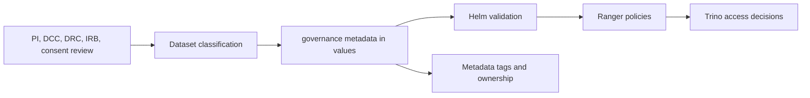

# Data Governance And Ranger Policy Model

This guide explains how the chart supports policy-compliant data exposure.

It is not a replacement for institutional governance. It is the technical layer
that enforces access after a dataset has been classified and approved.

## The Boundary



The chart can do these things:

- refuse to render non-local datasets that have no governance metadata
- refuse to expose restricted datasets with wildcard access or missing Ranger
  policy coverage
- require Ranger fine-grained policy coverage for restricted-identifiable data
- optionally import coarse catalog access lists into Ranger during migration

The chart cannot do these things:

- decide whether a dataset is allowed to exist on the platform
- replace PI ownership, DCC or DRC approval, IRB review, or consent review
- decide whether publication or external sharing is permitted

## Governance Metadata Contract

Every non-local catalog needs:

```yaml
global:
  dataCatalogs:
    redcap:
      governance:
        dataType: research
        classification: restricted-identifiable
        containsDirectIdentifiers: true
        containsQuasiIdentifiers: true
        consentBasis: approved-secondary-use
        irbStatus: required-approved
        sharingStatus: approved-secondary-use
        ownerPi: redcap-pi
        dataSteward: data-platform-team
        sourceSystem: redcap
        approvalReference: DCC-PROD-REDCAP
        retentionNotes: Retain according to the approved study retention schedule.
```

## How The Chart Interprets Classification

| Classification | What the chart expects |
| --- | --- |
| `restricted-identifiable` | Ranger enabled, explicit Ranger policy coverage, and fine-grained masking or row-filter policy coverage when identifiers are present |
| `restricted-deidentified` | Explicit Ranger policy coverage and no wildcard exposure |
| `internal-deidentified` | Explicit Ranger policy coverage and no wildcard exposure |
| `public` | Broad read access is allowed, but direct or quasi identifiers must be false |

## Ranger Mapping

The chart uses two policy sources:

1. `authorizedGroups`
   Migration-only input imported as coarse catalog policies when
   `global.authorization.ranger.importCatalogAcls=true`
2. `global.authorization.platformRoles`
   The Git-managed mapping between directory groups or approved direct users
   and named Ranger roles
3. `global.authorization.ranger.bootstrapPolicies`
   Used for table, column, row-filter, and masking policies, normally targeted
   at Ranger roles rather than raw groups or users

The steady-state model is:

- platform roles define the approved long-lived access bundles
- Ranger bootstrap policies target those roles
- `authorizedGroups` only helps move older catalog ACLs into Ranger while a
  consumer is transitioning

Temporary direct-user access should not become the default model. Use
time-bounded exception roles in Ranger for that case and attach approval
metadata plus expiry.

## DataHub Mapping

This chart treats DataHub as a metadata and discovery layer, not the SQL
enforcement engine.

In practice:

- the governance block is the source of truth in Helm
- DataHub tags and ownership should mirror that metadata through an operator
  workflow
- Ranger remains the enforcement plane for Trino

The chart does not yet push governance metadata into DataHub automatically.
Treat that mapping as a required manual step until a dedicated sync/export path
is added.

## New Data Source Rule

Do not add a new non-local catalog until all of the following are known:

1. Its classification.
2. Whether it contains direct or quasi identifiers.
3. Its PI owner and operational data steward.
4. Its consent and IRB status.
5. The approval reference that permits it to be on the platform.
6. The groups that may read or write it.
7. The platform roles that should carry that approved access.
8. Any masking or row-filter policy that sensitive columns or rows require.

If any of those are missing, the dataset is not ready to be exposed.

## Practical Maintainer Checklist

When adding a new dataset, update all of the following together:

- `global.dataCatalogs.<catalog>`
- `global.dataCatalogs.<catalog>.governance`
- `global.authorization.platformRoles` for the approved access bundles
- `global.authorization.ranger.bootstrapPolicies` with coarse read/write access plus any masking or row-filter rules
- only if you are explicitly migrating old ACLs: `global.dataCatalogs.<catalog>.authorizedGroups`
- downstream metadata tagging and ownership in DataHub, if enabled
- the human onboarding record that captures PI ownership, DCC/DRC or IRB
  approval, and consent constraints

If you need to grant one specific person extra data access temporarily, do not
quietly edit the long-lived baseline role. Create an exception role with
approval metadata and expiry, then let the audit job clean it up after the
grace period.

## Related Docs

- [auth-architecture.md](auth-architecture.md)
- [glossary.md](glossary.md)
- [../examples/values-dev.yaml](../examples/values-dev.yaml)
- [../examples/values-prod.yaml](../examples/values-prod.yaml)
