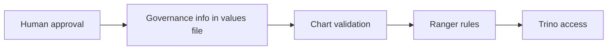

# Data Governance And Ranger Policy Model

This guide explains one simple idea:

the chart can block unsafe or incomplete data setup, but it does not replace
your human approval process.

## The Boundary



What the chart can do:

- stop a non-local dataset from being added without the required metadata
- stop sensitive data from being added without matching access rules

What the chart cannot do:

- decide whether your team should use a dataset at all
- replace ethics review, governance review, PI approval, or legal approval

## Governance Metadata Contract

For a non-local dataset, the chart expects a `governance` block like this:

```yaml
global:
  dataCatalogs:
    redcap:
      governance:
        dataType: research
        classification: restricted-identifiable
        containsDirectIdentifiers: true
        containsQuasiIdentifiers: true
        consentBasis: approved-secondary-use
        irbStatus: required-approved
        sharingStatus: approved-secondary-use
        ownerPi: redcap-pi
        dataSteward: data-platform-team
        sourceSystem: redcap
        approvalReference: DCC-PROD-REDCAP
        retentionNotes: Retain according to the approved study retention schedule.
```

In plain language, this block says:

- what kind of data this is
- how sensitive it is
- whether it contains identifying information
- who owns it
- who looks after it
- which approval record allows it to be here

## How The Chart Interprets Classification

| Classification | Simple meaning |
| --- | --- |
| `restricted-identifiable` | Sensitive data with identifying information; strict policy coverage is required |
| `restricted-deidentified` | Sensitive data without direct identifiers; explicit policy coverage is still required |
| `internal-deidentified` | Internal-only data; explicit policy coverage is still required |
| `public` | Public data; the identifier flags must still make sense |

## Ranger Mapping

There are three places access information can come from:

1. `global.authorization.platformRoles`
   The normal long-term access model.
2. `global.authorization.ranger.bootstrapPolicies`
   The detailed Ranger rules the chart creates.
3. `global.dataCatalogs.<catalog>.authorizedGroups`
   An older, simpler input kept for migration.

The normal recommended pattern is:

- define the long-term roles in `platformRoles`
- point Ranger rules at those roles
- use direct-user exceptions only when you really need them

## DataHub Mapping

In this repo, DataHub is for metadata and discovery.

Ranger is the thing used for SQL access rules.

The chart does not automatically copy the governance block into DataHub for
you.

## New Data Source Rule

Do not add a new non-local dataset until you know all of these:

1. What kind of data it is.
2. How sensitive it is.
3. Whether it contains identifying information.
4. Who owns it.
5. Who looks after it.
6. Which approval record allows it to be on the platform.
7. Which roles should be allowed to access it.

If you do not know those things yet, the dataset is not ready.

## Practical Maintainer Checklist

When you add a new governed dataset, update these together:

- `global.dataCatalogs.<catalog>`
- `global.dataCatalogs.<catalog>.governance`
- `global.authorization.platformRoles`
- `global.authorization.ranger.bootstrapPolicies`

If you need one person to get temporary extra access, use an exception role
instead of widening the normal access role for everyone.

## Related Docs

- [auth-architecture.md](auth-architecture.md)
- [glossary.md](glossary.md)
- [../examples/values-dev.yaml](../examples/values-dev.yaml)
- [../examples/values-prod.yaml](../examples/values-prod.yaml)
