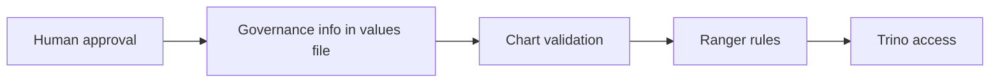

# Data Governance And Ranger Policy Model

This guide explains one simple idea:

the chart can block unsafe or incomplete data setup, but it does not replace
your human approval process.

Audience: readers who need to understand the required governed-data fields and
how those fields relate to access rules.

What you will learn: where the chart draws the line, which fields are required
for shared environments, and what those fields do and do not change at
runtime.

Read next: [auth-architecture.md](auth-architecture.md) for the access model,
or [../examples/README.md](../examples/README.md) for working examples.

## The Boundary



This governance model is organization-specific. It is the model enforced by
this chart and its example overlays. It is not a universal open-source data
governance standard.

What the chart can do:

- stop a non-local dataset from being added without the required metadata
- stop sensitive data from being added without matching access rules

What the chart cannot do:

- decide whether your team should use a dataset at all
- replace ethics review, governance review, PI approval, or legal approval

## Governance Metadata Contract

This heading uses the word "contract" because the chart validates the shape.
In practice, treat it as a required fields list.

For a non-local dataset, the chart expects a `governance` block like this:

```yaml
global:
  dataCatalogs:
    redcap:
      governance:
        dataType: research
        classification: restricted-identifiable
        containsDirectIdentifiers: true
        containsQuasiIdentifiers: true
        consentBasis: approved-secondary-use
        irbStatus: required-approved
        sharingStatus: approved-secondary-use
        ownerPi: redcap-pi
        dataSteward: data-platform-team
        sourceSystem: redcap
        approvalReference: DCC-PROD-REDCAP
        retentionNotes: Retain according to the approved study retention schedule.
```

Required fields in plain language:

| Field | Plain meaning |
| --- | --- |
| `dataType` | What kind of data this is. |
| `classification` | How sensitive the data is. |
| `containsDirectIdentifiers` | Whether the data directly identifies a person. |
| `containsQuasiIdentifiers` | Whether the data could help re-identify a person when combined with other information. |
| `consentBasis` | Why the data may be used. |
| `irbStatus` | Whether the approval process is complete. |
| `sharingStatus` | Whether the data may be shared and at what level. |
| `ownerPi` | Who is accountable for the dataset. |
| `dataSteward` | Who looks after the dataset day to day. |
| `sourceSystem` | Where the data came from. |
| `approvalReference` | The record that says the dataset is allowed on the platform. |
| `retentionNotes` | Notes about how long the data should be kept. |

## How The Chart Interprets Classification

| Classification | Simple meaning |
| --- | --- |
| `restricted-identifiable` | Sensitive data with identifying information; strict policy coverage is required |
| `restricted-deidentified` | Sensitive data without direct identifiers; explicit policy coverage is still required |
| `internal-deidentified` | Internal-only data; explicit policy coverage is still required |
| `public` | Public data; the identifier flags must still make sense |

## Resulting Behavior

This table shows the end-to-end effect of the main governance inputs:

| Input | What the chart checks | Effect in Ranger | Effect in Trino | Effect in DataHub |
| --- | --- | --- | --- | --- |
| Missing `governance` block in `dev` or `prod` | Install fails | No policies are applied because rendering stops | No catalog access is created because rendering stops | Nothing is pushed automatically |
| Invalid field combinations such as `sharingStatus=public` with non-public `classification` | Install fails | No policies are applied because rendering stops | No catalog access is created because rendering stops | Nothing is pushed automatically |
| Sensitive classifications with wildcard access or no explicit allowlist | Install fails | The chart refuses broad policy coverage for sensitive data | No access rules are produced for that catalog because rendering stops | Nothing is pushed automatically |
| `restricted-identifiable` with identifier flags but no masking or row filter policy | Install fails | Requires an explicit fine-grained Ranger policy | Trino access is blocked at install time until that policy exists | Nothing is pushed automatically |
| Valid `authorizedGroups` and/or explicit `bootstrapPolicies` | Ranger automation can create or import catalog rules | Catalog access rules are created or imported | Trino can use those rules only when the Ranger plugin path is enabled; otherwise Trino continues to use its configured rule path | Nothing is copied automatically from the governance block |
| Metadata fields such as `ownerPi`, `dataSteward`, and `approvalReference` | Presence is checked in shared environments | No direct runtime policy change by themselves | No direct runtime query change by themselves | The chart does not automatically map them into DataHub |

## Ranger Mapping

There are three places access information can come from:

1. `global.authorization.platformRoles`
   The normal long-term access model.
2. `global.authorization.ranger.bootstrapPolicies`
   The detailed Ranger rules the chart creates.
3. `global.dataCatalogs.<catalog>.authorizedGroups`
   An older, simpler input kept for migration.

The normal recommended pattern is:

- define the long-term roles in `platformRoles`
- point Ranger rules at those roles
- use direct-user exceptions only when you really need them

## DataHub Mapping

In this repo, DataHub is for metadata and discovery.

Ranger is the thing used for SQL access rules.

The chart does not automatically copy the governance block into DataHub for
you. If you want matching metadata in DataHub, you still need to model that in
your wider platform setup.

## New Data Source Rule

Do not add a new non-local dataset until you know all of these:

1. What kind of data it is.
2. How sensitive it is.
3. Whether it contains identifying information.
4. Who owns it.
5. Who looks after it.
6. Which approval record allows it to be on the platform.
7. Which roles should be allowed to access it.

If you do not know those things yet, the dataset is not ready.

## Practical Maintainer Checklist

When you add a new governed dataset, update these together:

- `global.dataCatalogs.<catalog>`
- `global.dataCatalogs.<catalog>.governance`
- `global.authorization.platformRoles`
- `global.authorization.ranger.bootstrapPolicies`

If you need one person to get temporary extra access, use an exception role
instead of widening the normal access role for everyone.

## Related Docs

- [auth-architecture.md](auth-architecture.md)
- [glossary.md](glossary.md)
- [../examples/values-dev.yaml](../examples/values-dev.yaml)
- [../examples/values-prod.yaml](../examples/values-prod.yaml)
