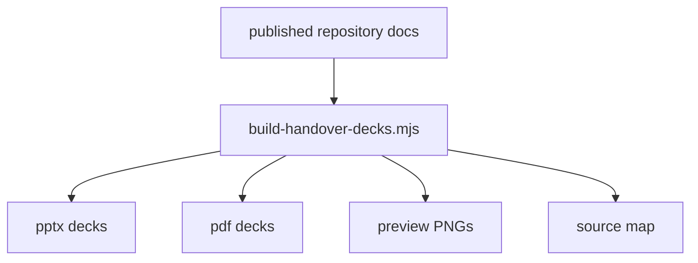

# DLH-in-a-box Handover Deck Kit

This folder contains generated handover decks for developers inheriting the repository.



## Contents

| Path | Purpose |
| --- | --- |
| [build-handover-decks.mjs](build-handover-decks.mjs) | Reproducible generator for the decks, PDFs, previews, and source map. |
| [pptx/](pptx/) | Editable PowerPoint handover decks with speaker notes. |
| [pdf/](pdf/) | PDF exports for presentation or handout use. |
| [previews/](previews/) | Full-slide PNG previews and contact sheets used for visual QA. |
| [assets/](assets/) | Rendered diagram assets used by the decks. |
| [source-map.md](source-map.md) | Mapping from sessions to source documentation and diagrams. |

## Rebuild

From the repository root:

```bash
npm --prefix docs run build:handover
```
