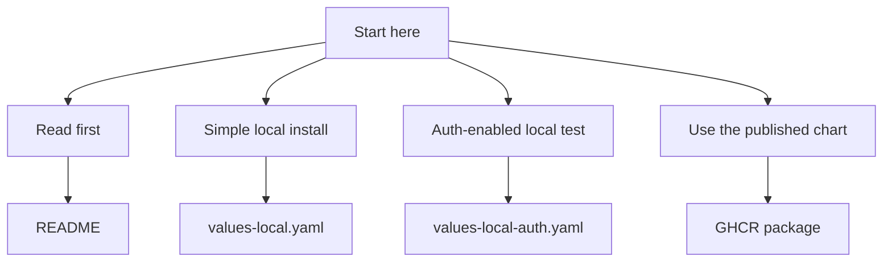

# Quickstart

This guide answers one question:

What should I run next?

## Choose your path



## 1. Read first if you are new

If you do not already know what this repo is, read these first:

1. [../README.md](../README.md)
2. [../charts/dlh-in-a-box/README.md](../charts/dlh-in-a-box/README.md)
3. [glossary.md](glossary.md)

## 2. Run the simplest local install

Use `examples/values-local.yaml` if you want the easiest local install.

Why this is the easiest one:

- it needs fewer moving parts
- it does not need pre-created demo Secrets
- it is the best first install if you just want to see the chart work

Run this from the repository root:

```bash
./hack/helm-dependency-update.sh
./hack/lint.sh
helm upgrade --install dlh charts/dlh-in-a-box \
  -n data-lakehouse-local \
  --create-namespace \
  -f examples/values-local.yaml
```

Then check what was created:

```bash
kubectl get all -n data-lakehouse-local
```

Useful local access commands:

```bash
kubectl port-forward -n data-lakehouse-local svc/dlh-trino 8080:8080
kubectl port-forward -n data-lakehouse-local svc/prefect-server 4200:4200
kubectl port-forward -n data-lakehouse-local svc/dlh-minio 9001:9001
kubectl port-forward -n data-lakehouse-local svc/dlh-vault 8200:8200
```

## 3. Run the auth-enabled local test

Use `examples/values-local-auth.yaml` if you want to test the login-related
parts too.

That example turns on more pieces, such as:

- Keycloak for login
- Ranger for roles and access
- platformHome for the browser home page
- CloudBeaver and Prefect behind auth proxies

Important:

- this example expects demo Kubernetes Secrets to exist first
- `make smoke-install` creates those demo Secrets for you
- a plain `helm upgrade --install ... -f examples/values-local-auth.yaml`
  will fail if you did not create the Secrets yourself

So the normal way to run it is:

```bash
make smoke-install
```

Or:

```bash
./hack/smoke-install.sh charts/dlh-in-a-box examples/values-local-auth.yaml
```

Useful local access commands after that install:

```bash
kubectl port-forward -n data-lakehouse-local svc/dlh-platform-home 8110:80
kubectl port-forward -n data-lakehouse-local svc/dlh-prefect-auth-proxy 4200:80
kubectl port-forward -n data-lakehouse-local svc/dlh-cloudbeaver-auth-proxy 8978:80
kubectl port-forward -n data-lakehouse-local svc/dlh-keycloak 8081:80
kubectl port-forward -n data-lakehouse-local svc/dlh-ranger-admin 6080:6080
kubectl port-forward -n data-lakehouse-local svc/dlh-trino 8443:8443
```

## 4. Use the published chart

If you do not want to work from the repo source, you can inspect the published
chart package:

```bash
helm show chart oci://ghcr.io/sanger-pathogens/charts/dlh-in-a-box --version <chart-version>
helm show readme oci://ghcr.io/sanger-pathogens/charts/dlh-in-a-box --version <chart-version>
```

If another repository wants to use this chart as a dependency, its
`Chart.yaml` will look like this:

```yaml
dependencies:
  - name: dlh-in-a-box
    version: <chart-version>
    repository: oci://ghcr.io/sanger-pathogens/charts
```

## 5. What to read next

- want to understand the chart:
  [../charts/dlh-in-a-box/README.md](../charts/dlh-in-a-box/README.md)
- want example config files:
  [../examples/README.md](../examples/README.md)
- want to understand login and access:
  [auth-architecture.md](auth-architecture.md)
- want to understand data approval rules:
  [data-governance.md](data-governance.md)
