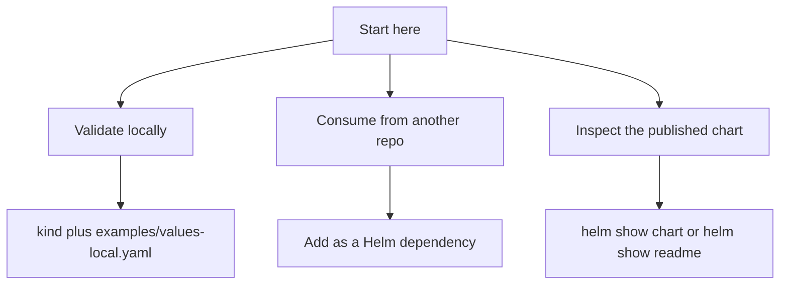

# First Five Minutes

This guide is for someone who has just discovered `dlh-in-a-box` and wants to
get from zero to a working deployment path quickly.

## Choose your path



## 1. Inspect the published chart

```bash
helm show chart oci://ghcr.io/sanger-pathogens/charts/dlh-in-a-box --version <chart-version>
helm show readme oci://ghcr.io/sanger-pathogens/charts/dlh-in-a-box --version <chart-version>
```

Use this when you want to confirm the published metadata, dependencies, and
consumer-facing README before you install anything.

## 2. Deploy the validated local example

From this repository:

```bash
./hack/helm-dependency-update.sh
./hack/lint.sh
helm upgrade --install dlh charts/dlh-in-a-box \
  -n data-lakehouse-local \
  --create-namespace \
  -f examples/values-local.yaml
```

Then inspect the result:

```bash
kubectl get all -n data-lakehouse-local
```

Useful port-forwards:

```bash
kubectl port-forward -n data-lakehouse-local svc/prefect-server 4200:4200
kubectl port-forward -n data-lakehouse-local svc/dlh-minio 9001:9001
kubectl port-forward -n data-lakehouse-local svc/dlh-trino 8080:8080
kubectl port-forward -n data-lakehouse-local svc/dlh-vault 8200:8200
```

## 3. Consume the chart from another repository

In the consumer repository `Chart.yaml`:

```yaml
dependencies:
  - name: dlh-in-a-box
    version: <chart-version>
    repository: oci://ghcr.io/sanger-pathogens/charts
```

In the consumer workflow:

```yaml
permissions:
  contents: read
  packages: read

steps:
  - uses: actions/checkout@v4
  - uses: azure/setup-helm@v4
  - name: Log in to GHCR
    run: |
      printf '%s' "${{ secrets.GITHUB_TOKEN }}" | \
        helm registry login ghcr.io -u "${{ github.actor }}" --password-stdin
  - name: Build chart dependencies
    run: helm dependency build
```

If the consumer repository cannot read the package yet, add it under GitHub
package settings `Manage Actions access`.

## 4. Know where to go next

- chart API and values surface:
  [../charts/dlh-in-a-box/README.md](../charts/dlh-in-a-box/README.md)
- overlay selection:
  [../examples/README.md](../examples/README.md)
- support expectations:
  [../SUPPORT.md](../SUPPORT.md)
- release and publication flow:
  [release-playbook.md](release-playbook.md)
