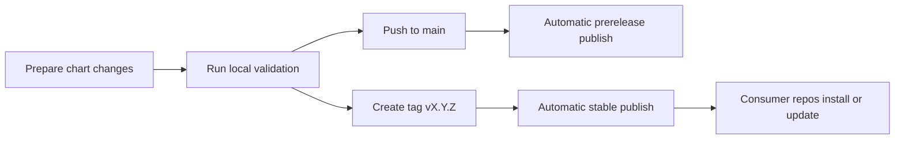

# Release Playbook

This guide describes how to validate, package, and publish `dlh-in-a-box`
reliably.

## Release flow



## Release types

| Release type | Trigger | Version shape | Primary use |
| --- | --- | --- | --- |
| Prerelease | Push to `main` | `<base>-main.<run>.<attempt>.<sha>` | Integration testing and downstream smoke checks |
| Stable release | Push tag `vX.Y.Z` | `X.Y.Z` | Normal downstream consumption and pinning |

## Before you publish

Run the standard checks:

```bash
make deps
make lint
make template
make package
```

Or the underlying scripts:

```bash
./hack/helm-dependency-update.sh
./hack/lint.sh
./hack/template.sh
./hack/package.sh
```

Checklist:

- `charts/dlh-in-a-box/Chart.yaml` version is correct
- `Chart.lock` matches dependency intent
- documentation reflects any values or workflow changes
- license and third-party notices are still current
- example overlays still lint and render

## Stable release procedure

1. Set the desired chart version in `charts/dlh-in-a-box/Chart.yaml`.
2. Run the validation sequence.
3. Commit the release-ready state.
4. Create and push a Git tag in the form `vX.Y.Z`.
5. Confirm the `helm-publish` workflow publishes `X.Y.Z` to GHCR.
6. Smoke-test the published package:

```bash
helm show chart oci://ghcr.io/sanger-pathogens/charts/dlh-in-a-box --version X.Y.Z
helm show readme oci://ghcr.io/sanger-pathogens/charts/dlh-in-a-box --version X.Y.Z
```

## Prerelease procedure

Push to `main` and let `helm-publish` produce the prerelease automatically.
Use that package for same-organization integration testing before you cut a tag.

## Consumer communication

After a stable release:

- update internal consumers to pin the new version
- share the exact install or dependency stanza
- call out any values-surface, dependency, or operational changes

## Related guides

- onboarding:
  [quickstart.md](quickstart.md)
- workflow behavior:
  [../.github/workflows/README.md](../.github/workflows/README.md)
- maintainer scripts:
  [../hack/README.md](../hack/README.md)
