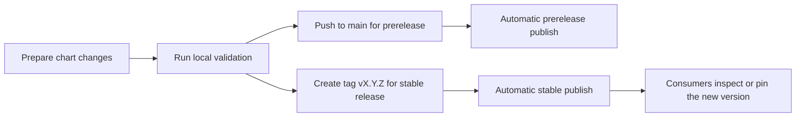

# Release Playbook

This guide describes how to validate, package, and publish `dlh-in-a-box`
reliably.

## Release flow



## Release types

| Release type | Trigger | Version shape | Primary use |
| --- | --- | --- | --- |
| Prerelease | Push to `main` | `<base>-main.<run>.<attempt>.<sha>` | Downstream integration testing before a tagged release |
| Stable release | Push tag `vX.Y.Z` | `X.Y.Z` | Normal downstream consumption and pinning |

## Before you publish

Run the standard local checks:

```bash
make deps
make lint
make template
make package
```

If you want the auth-enabled local proof path before a release, also run:

```bash
make smoke-install
```

Equivalent script form:

```bash
./hack/helm-dependency-update.sh
SKIP_MERMAID_CHECK=1 ./hack/docs-check.sh
./hack/lint.sh
./hack/template.sh
./hack/package.sh
./hack/smoke-install.sh
```

Checklist:

- `charts/dlh-in-a-box/Chart.yaml` version is correct
- `Chart.lock` matches dependency intent
- docs reflect the current values surface and workflow behavior
- example overlays still lint and render
- third-party notices are still current
- the auth-enabled smoke path still succeeds when you choose to run it

## Stable release procedure

1. Set the target chart version in `charts/dlh-in-a-box/Chart.yaml`.
2. Run the validation sequence.
3. Commit the release-ready state.
4. Create and push a Git tag in the form `vX.Y.Z`.
5. Confirm the `helm-publish` workflow publishes `X.Y.Z` to GHCR.
6. Inspect the published package:

```bash
helm show chart oci://ghcr.io/sanger-pathogens/charts/dlh-in-a-box --version X.Y.Z
helm show readme oci://ghcr.io/sanger-pathogens/charts/dlh-in-a-box --version X.Y.Z
```

## Prerelease procedure

Push to `main` and let `helm-publish` create the prerelease automatically.

Use that package for downstream integration testing before you cut a stable
tag.

## Consumer communication

After a stable release:

- update downstream consumers to pin the new version
- share the install or dependency stanza they need
- call out values-surface, dependency, or workflow changes that affect them

## Related guides

- quick practical paths:
  [quickstart.md](quickstart.md)
- workflow behavior:
  [../.github/workflows/README.md](../.github/workflows/README.md)
- maintainer scripts:
  [../hack/README.md](../hack/README.md)
