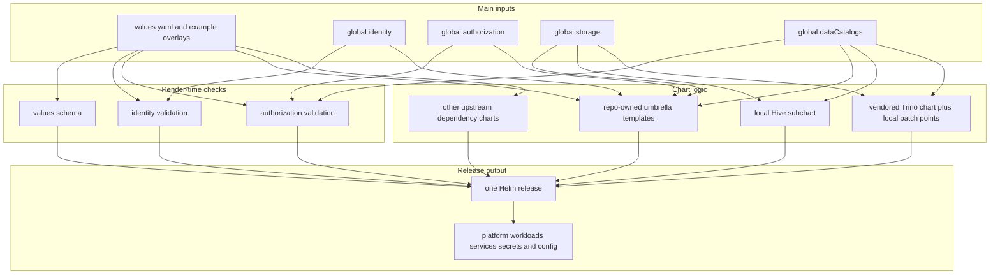
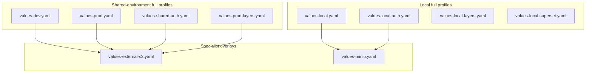
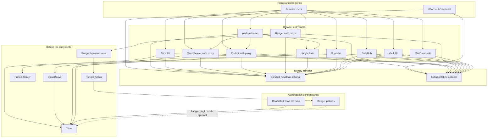
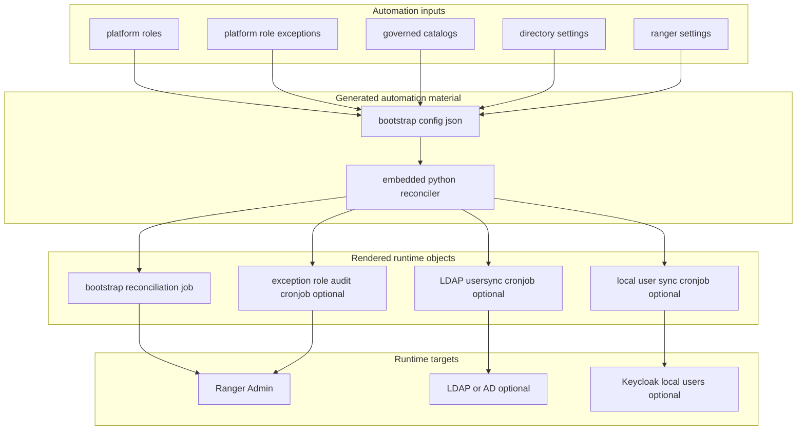
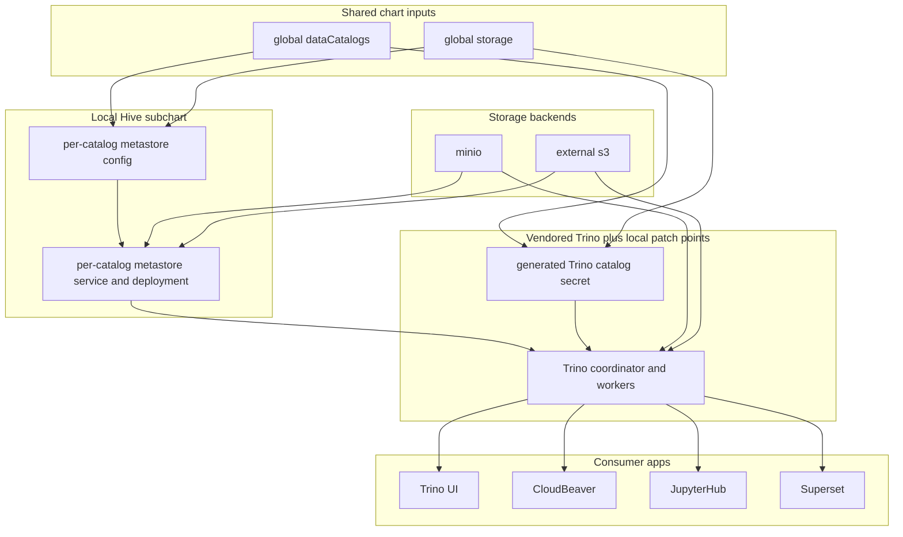
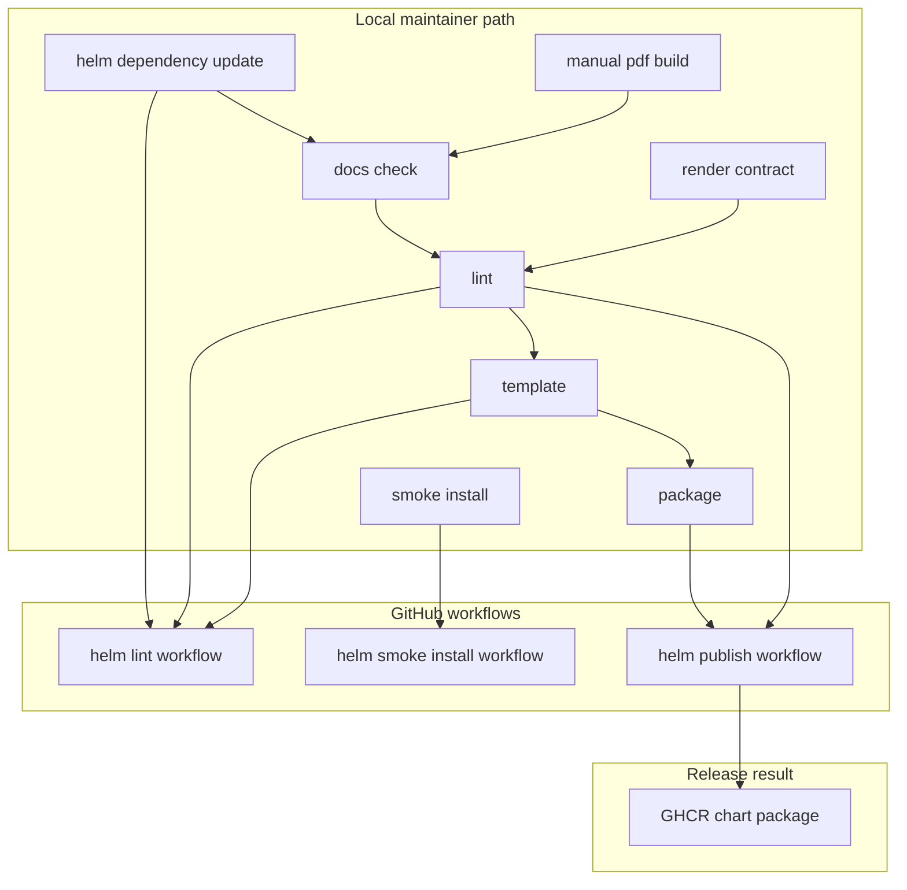

# dlh-in-a-box Umbrella Chart Manual

This Markdown file is the single-source narrative manual for the
`dlh-in-a-box` umbrella chart. The tracked PDF at
`docs/umbrella-chart-manual.pdf` is generated directly from this file.

The folder-local guides in the repository remain the authoritative source for
directory-level ownership and file-by-file detail. This manual is the
newcomer-first synthesis that explains the system end-to-end and ties those
guides back to the code paths that actually implement the behavior.

## Manual Scope

- This manual covers the first-party umbrella chart repo, example overlays,
  maintainer scripts, workflows, the local Hive subchart, and the
  behaviorally important vendored Trino integration points.
- It excludes `references/**`, which is intentionally outside the published
  chart surface.
- It treats vendored upstream Trino documentation as reference input only. It
  summarizes the repo-relevant behavior instead of rewriting the vendored
  upstream `README.md`.

## Who This Manual Is For

| Reader | What they should get from this manual |
| --- | --- |
| evaluator | a plain-language explanation of what problem the chart solves |
| deployer | one true first-success path and a safe way to choose example overlays |
| operator | a clear mental model for identity, storage, governance, and runtime ownership |
| contributor | a map from "I need to change X" to the right code paths and checks |
| maintainer | local validation, workflow parity, release behavior, and manual rebuild instructions |

## How To Use This Manual

- Read the first four sections straight through if you are new to the repo.
- Use the install-profile and contributor sections as quick lookup references
  after that.
- Treat the manual as the narrative guide and the folder-local READMEs as the
  close-up reference material.

## Table Of Contents

- [What This Repository Is For](#what-this-repository-is-for)
- [What This Repository Does Not Do](#what-this-repository-does-not-do)
- [Prerequisites](#prerequisites)
- [One True First-Success Path](#one-true-first-success-path)
- [Platform Architecture](#platform-architecture)
- [Install Profiles](#install-profiles)
- [Repository And Chart Structure](#repository-and-chart-structure)
- [Values Model And Render Flow](#values-model-and-render-flow)
- [Identity And Browser Access](#identity-and-browser-access)
- [Governance And Authorization](#governance-and-authorization)
- [Query Storage And Metadata Path](#query-storage-and-metadata-path)
- [Component Guide](#component-guide)
- [Contributor Change Map](#contributor-change-map)
- [Validation CI And Release Flow](#validation-ci-and-release-flow)
- [Troubleshooting](#troubleshooting)
- [Glossary](#glossary)
- [Secrets And Environment Appendix](#secrets-and-environment-appendix)

## What This Repository Is For

In plain language, this repository publishes one Helm chart that installs a
ready-made analytics platform on Kubernetes so a team does not have to wire
login, query services, storage, browser tools, and governed access control
together by hand.

The chart is called `dlh-in-a-box`.

The main job of the chart is not "install Trino" or "install Keycloak" in
isolation. Its real job is to define how those tools fit together as one
deployable platform:

- shared identity and group mapping
- shared storage and catalog wiring
- governed query access
- optional browser and workflow tools around the core data path

This repo gives you one install surface for those decisions.

## What This Repository Does Not Do

This repo does not:

- create a Kubernetes cluster for you
- provision real cloud buckets, DNS records, or certificates
- generate safe production secrets
- decide your institution's governance policy for you
- replace upstream documentation for Trino, Keycloak, Superset, Prefect,
  JupyterHub, DataHub, Vault, or MinIO

It is a platform assembly layer, not a cluster bootstrap toolkit and not a
generic replacement for the upstream products it packages.

## Prerequisites

### What You Need Before You Can Install The Chart

| Requirement | Why you need it | Notes |
| --- | --- | --- |
| Kubernetes cluster | the chart deploys into Kubernetes | use an existing cluster or a disposable local cluster |
| `kubectl` | to inspect namespaces, pods, services, and events | it must be compatible with your cluster |
| `helm` | to render, install, upgrade, lint, and package the chart | CI currently uses Helm `v3.12.0` |
| current kube context | every install command depends on it | many "chart" failures are really wrong-context failures |
| enough cluster capacity | the local profiles still create several Deployments, Jobs, and databases | the simplest profile is still larger than a single-service demo |

### What You Need For The Local Disposable Path

| Extra tool | Why it matters | Notes |
| --- | --- | --- |
| Docker | required for `kind` and local Mermaid validation in repo checks | CI uses Docker-backed kind and Docker-backed Mermaid rendering |
| kind | optional but strongly recommended if you do not already have a cluster | the smoke workflow uses a kind cluster, so it is the known-good disposable path |

### What You Need For Manual Rebuild Of This PDF

This manual itself has a separate docs-local build path:

- `node`
- `npm`
- a one-time Playwright Chromium download on first PDF build

Those are only needed if you are rebuilding the tracked PDF, not if you are
installing the chart.

## One True First-Success Path

The safest first manual path is `examples/values-local.yaml`.

That path is intentionally simpler than the auth-heavy smoke path. It does not
exercise every optional browser feature, but it gives a newcomer the cleanest
first successful install with the fewest moving pieces.

### Use This Path, Not The Auth-Heavy Wrapper

Do this first:

- install with `helm upgrade --install ... -f examples/values-local.yaml`

Do not do this as your first attempt unless you deliberately want the
auth-heavy local stack:

- `make local-install`
- `make smoke-install`

Why:

- `make local-install` uses `LOCAL_VALUES`, which defaults to
  `examples/values-local.yaml` in the current `Makefile`
- `make smoke-install` is intentionally the stronger auth and access test path,
  not the easiest newcomer install. This target uses `LOCAL_VALUES_AUTH`, which defaults
  to `examples/values-local-auth.yaml`

### Optional Disposable Cluster Setup With kind

If you do not already have a cluster, kind is the simplest local path the repo
already trusts in CI:

```bash
kind create cluster --name dlh-local
kubectl config use-context kind-dlh-local
kubectl cluster-info
```

If you already have a cluster and a safe current context, you can skip this.

### Install Commands

From the repository root:

```bash
./scripts/helm-dependency-update.sh
helm upgrade --install dlh charts/dlh-in-a-box \
  -n data-lakehouse-local \
  --create-namespace \
  -f examples/values-local.yaml
kubectl get pods -n data-lakehouse-local
helm status dlh -n data-lakehouse-local
kubectl get svc -n data-lakehouse-local
```

### What Success Looks Like

For the first-success path, success means:

- `helm upgrade --install` exits successfully
- `helm status dlh -n data-lakehouse-local` reports a healthy release
- `kubectl get pods -n data-lakehouse-local` shows the local stack moving to
  `Running` or `Completed`
- `kubectl get svc -n data-lakehouse-local` shows the expected local services

The local minimal path is primarily proving:

- Trino
- Hive Metastore plus its PostgreSQL backing service
- MinIO-backed storage
- Prefect server and worker
- Spark Operator
- Vault in dev mode

### Common First-Time Failures

| Failure pattern | What it usually means |
| --- | --- |
| install fails before resources appear | stale dependency archives or `Chart.lock`; run `./hack/helm-dependency-update.sh` first |
| everything renders but pods fail later | wrong cluster, not enough capacity, or a backing service not becoming ready |
| manual local auth install fails unexpectedly | you used `values-local-auth.yaml` without the demo secrets that `smoke-install.sh` seeds |
| services appear but the stack shape does not match the docs | the wrong example overlay was used |

## Platform Architecture

The platform is modular. You do not have to enable every component, but the
chart is capable of assembling the full stack below when all optional pieces
are turned on.

### All Components Enabled

```mermaid
flowchart TD
  subgraph Entry["Browser entrypoints"]
    Portal[platformHome optional]
    TrinoUi[Trino UI]
    CloudBeaverProxy[CloudBeaver auth proxy optional]
    PrefectProxy[Prefect auth proxy optional]
    RangerProxy[Ranger auth proxy optional]
    JupyterUi[JupyterHub optional]
    SupersetUi[Superset optional]
    DataHubUi[DataHub optional]
    VaultUi[Vault UI optional]
    MinioUi[MinIO console optional]
  end

  subgraph Identity["Identity"]
    LDAP[LDAP or AD optional]
    Keycloak[Bundled Keycloak optional]
    ExternalOidc[External OIDC optional]
  end

  subgraph Governance["Governance and policy"]
    RangerAdmin[Ranger Admin optional]
    RangerAutomation[Ranger automation optional]
  end

  subgraph Query["Query and metadata"]
    Trino[Trino]
    Hive[Hive Metastore optional]
    CloudBeaver[CloudBeaver optional]
    JupyterHub[JupyterHub optional]
    Superset[Superset optional]
    DataHub[DataHub optional]
    DataHubDeps[DataHub prerequisites optional]
  end

  subgraph Orchestration["Orchestration and compute"]
    PrefectServer[Prefect Server optional]
    PrefectWorkers[Prefect Workers optional]
    SparkOperator[Spark Operator optional]
  end

  subgraph Storage["Storage and secrets"]
    MinIO[MinIO optional]
    ExternalS3[External S3 optional]
    Vault[Vault optional]
  end

  subgraph Backing["Backing services"]
    KeycloakDb[Keycloak PostgreSQL optional]
    RangerDb[Ranger PostgreSQL optional]
    HiveDb[Hive PostgreSQL optional]
    PrefectDb[Prefect PostgreSQL optional]
    SupersetBacking[Superset PostgreSQL and Redis optional]
    DataHubBacking[Kafka Zookeeper MySQL optional]
  end

  LDAP --> Keycloak
  Portal --> Keycloak
  Portal --> ExternalOidc
  TrinoUi --> Keycloak
  TrinoUi --> ExternalOidc
  CloudBeaverProxy --> Keycloak
  CloudBeaverProxy --> ExternalOidc
  PrefectProxy --> Keycloak
  PrefectProxy --> ExternalOidc
  RangerProxy --> Keycloak
  RangerProxy --> ExternalOidc
  JupyterUi --> Keycloak
  JupyterUi --> ExternalOidc
  SupersetUi --> Keycloak
  SupersetUi --> ExternalOidc
  DataHubUi --> Keycloak
  DataHubUi --> ExternalOidc
  VaultUi --> Keycloak
  VaultUi --> ExternalOidc
  MinioUi --> Keycloak
  MinioUi --> ExternalOidc

  Portal --> CloudBeaverProxy
  Portal --> PrefectProxy
  Portal --> JupyterUi
  Portal --> VaultUi

  TrinoUi --> Trino
  CloudBeaverProxy --> CloudBeaver
  PrefectProxy --> PrefectServer
  RangerProxy --> RangerAdmin
  JupyterUi --> JupyterHub
  SupersetUi --> Superset
  DataHubUi --> DataHub
  VaultUi --> Vault
  MinioUi --> MinIO

  CloudBeaver --> Trino
  JupyterHub --> Trino
  Superset --> Trino
  Hive --> Trino
  MinIO --> Hive
  MinIO --> Trino
  ExternalS3 --> Hive
  ExternalS3 --> Trino
  RangerAdmin --> RangerAutomation
  RangerAdmin --> RangerDb
  Keycloak --> KeycloakDb
  Hive --> HiveDb
  PrefectServer --> PrefectDb
  PrefectServer --> PrefectWorkers
  Superset --> SupersetBacking
  DataHub --> DataHubDeps
  DataHubDeps --> DataHubBacking
```



### How The Chart Assembles The Runtime

The chart does not directly "hardcode one platform image." It composes the
runtime from shared values, validation templates, repo-owned integration
templates, and dependency charts.



## Install Profiles

The `examples/` folder is the fastest way to understand the supported install
shapes.

### Profile Map



### Full Install Profiles

| File | Auth model | Storage model | Main components | Use it when | Avoid it when |
| --- | --- | --- | --- | --- | --- |
| `values-local.yaml` | no shared identity contract | MinIO | Trino, Hive, Prefect, Spark Operator, Vault | you want the cleanest first local install | you need browser auth or Ranger |
| `values-local-auth.yaml` | bundled Keycloak plus `keycloakLocal` | MinIO | local stack plus Keycloak, Ranger, `platformHome`, CloudBeaver, Prefect auth proxy | you are testing auth, proxies, and local governance | you want the easiest first install |
| `values-local-layers.yaml` | no shared identity contract | MinIO | local stack with layered bronze, silver, gold, and geospatial catalogs | you are testing catalog iteration or layered datasets | you need shared-auth behavior |
| `values-local-superset.yaml` | local Superset bootstrap rather than shared OIDC pattern | MinIO | Trino plus Superset-focused local stack | you are focusing on a local BI-only path | you need the broader shared browser stack |
| `values-dev.yaml` | bundled Keycloak plus external LDAP | external S3 | Trino, Ranger, `platformHome`, JupyterHub, CloudBeaver, Prefect | you want the main shared development baseline | you already have an external OIDC provider |
| `values-prod.yaml` | bundled Keycloak plus external LDAP | external S3 | production-shaped shared stack with stricter assumptions | you want the main production-shaped baseline | you want a fully turnkey production deployment with no external prep |
| `values-shared-auth.yaml` | external OIDC plus external LDAP | external S3 | shared browser stack without bundled Keycloak, including Superset and DataHub | your organization already has an OIDC provider | you need the bundled Keycloak path |
| `values-prod-layers.yaml` | layered production-shaped shared auth inherited from its profile | external S3 | governed layered catalogs plus Hive and Vault | you are modeling layered governed production datasets | you need a minimal starting point |

### Specialist Overlays

| File | What it changes | Important rule |
| --- | --- | --- |
| `values-external-s3.yaml` | switches the storage layer to an external S3-compatible backend | not a standalone install; layer it on top of a full profile |
| `values-minio.yaml` | enables or reinforces MinIO-backed storage using a secret-backed local shape | not a standalone install; layer it on top of a full profile |

### Overlay Composition Examples

```bash
helm upgrade --install dlh charts/dlh-in-a-box \
  -n data-lakehouse \
  --create-namespace \
  -f examples/values-dev.yaml \
  -f examples/values-external-s3.yaml
```

```bash
helm upgrade --install dlh charts/dlh-in-a-box \
  -n data-lakehouse-local \
  --create-namespace \
  -f examples/values-local.yaml \
  -f examples/values-minio.yaml
```

### Secret Expectations By Example Class

| Example class | Secret expectation |
| --- | --- |
| local minimal examples | may include safe demo-oriented local credentials |
| local auth-heavy smoke profile | demo secrets are seeded by `scripts/helm/smoke-install.sh` when that exact file is used |
| shared dev, prod, and external-auth profiles | expect real hostnames, OIDC client secrets, directory bind secrets, and storage credentials to exist already |

## Repository And Chart Structure

### Root-Level Mental Model

| Path | What it owns | Why it matters |
| --- | --- | --- |
| `charts/dlh-in-a-box/` | the published umbrella chart | this is the center of gravity of the repo |
| `examples/` | example values overlays | use this to choose and understand install profiles |
| `scripts/` | local validation, packaging, smoke, and contract scripts | CI mirrors these scripts closely |
| `.github/` | review routing, issue forms, and workflows | this is where release and CI policy lives |
| `docs/` | small docs support area plus this manual | the main narrative now lives next to the code, not only here |
| `references/` | out-of-scope reference material | useful context, not part of the published chart surface |

### Chart Ownership Layers

The published chart mixes four kinds of material:

| Material type | Where it lives | What it means |
| --- | --- | --- |
| first-party umbrella chart logic | `charts/dlh-in-a-box/values.yaml` and `templates/` | repo-owned cross-component behavior |
| first-party local subchart | `charts/dlh-in-a-box/charts/hive/` | repo-owned Hive Metastore generation |
| first-party local wrapper subchart | `charts/dlh-in-a-box/charts/shared-postgresql/` | lets `sharedPostgresql.bundled.*` reach a nested Bitnami PostgreSQL dependency; see [Shared PostgreSQL](#shared-postgresql) |
| vendored upstream source with local patch points | `charts/dlh-in-a-box/charts/trino/` | mostly upstream Trino chart code plus a small local patch set |
| packaged dependency archives | `charts/dlh-in-a-box/charts/*.tgz` | reproducible dependency bundles used for packaging and release |

### Dependency Inventory

The current dependency list is defined in `charts/dlh-in-a-box/Chart.yaml`.

The most important dependencies are:

| Dependency | Why it is bundled |
| --- | --- |
| Trino | main SQL engine |
| Hive | local subchart for per-catalog metastore generation |
| Keycloak | default bundled browser identity provider |
| Prefect server and worker | self-hosted workflow UI and workers |
| oauth2-proxy aliases | browser auth boundaries for Prefect, CloudBeaver, and Ranger |
| MinIO | in-cluster S3-compatible object store |
| DataHub and DataHub prerequisites | metadata and discovery UI plus Kafka, Zookeeper, and MySQL-facing dependencies |
| JupyterHub | notebook environment with shared identity |
| Superset | BI application |
| Vault | optional secrets tooling and UI |
| PostgreSQL aliases | backing databases for Ranger and Hive |

### Files That Move Together During Dependency Changes

When a dependency version changes, review these as one unit:

- `charts/dlh-in-a-box/Chart.yaml`
- `charts/dlh-in-a-box/Chart.lock`
- packaged archives under `charts/dlh-in-a-box/charts/`
- `charts/dlh-in-a-box/THIRD_PARTY_NOTICES.md`
- provenance files under `charts/dlh-in-a-box/third_party/`

## Values Model And Render Flow

`charts/dlh-in-a-box/values.yaml` is large because it does two jobs at once:

- define the umbrella chart's shared cross-component contract
- pass values through to upstream dependency charts

### Shared Cross-Component Contract

| Values path | What it controls |
| --- | --- |
| `global.identity` | provider mode, directory mode, OIDC clients, shared group naming |
| `global.authorization` | platform roles, direct-user exceptions, Ranger settings, governed-data expectations |
| `global.storage` | MinIO versus external S3 and shared storage credentials |
| `global.dataCatalogs` | the catalog definitions that drive Hive and Trino generation |

### App-Specific First-Party Sections

| Values path | What it controls |
| --- | --- |
| `platformHome` | launchpad UI, helper API, health checks, and admin UI |
| `cloudbeaver` | bootstrap, trust store, auth-proxy integration, and shared connection seeding |
| `prefect` | high-level Prefect toggles and optional flow-run job-runner Kubernetes primitives |
| `prefect-auth-proxy` | oauth2-proxy configuration in front of Prefect |
| `cloudbeaver-auth-proxy` | oauth2-proxy configuration in front of CloudBeaver |
| `ranger-auth-proxy` | oauth2-proxy configuration in front of Ranger browser access |

### Dependency Pass-Through Sections

These mostly expose upstream chart values at the umbrella level:

- `keycloak`
- `prefectServer`
- `prefectWorker`
- `sparkOperator`
- `minio`
- `datahub`
- `datahubPrerequisites`
- `superset`
- `jupyterhub`
- `vault`
- `rangerPostgresql`
- `sharedPostgresql`

### Shared PostgreSQL

By default every app that needs PostgreSQL runs its own bundled bitnami pod
(`keycloak.postgresql`, `prefectServer.postgresql`, `superset.postgresql`,
`rangerPostgresql`, `hive.postgresql` -- a dependency owned by the `hive`
subchart itself rather than a sibling at the umbrella level, since
`hive.postgresql.enabled` also decides whether Hive self-creates its
per-catalog databases). `sharedPostgresql` is an optional consolidation: one PostgreSQL instance plus a
chart-owned provisioning Job (`templates/shared-postgresql-provisioning.yaml`)
that creates a database, role, and password Secret for each app listed in
`sharedPostgresql.provisioning.database-list` or the new map-based
`sharedPostgresql.provisioning.databases`.

`sharedPostgresql.enabled` is the master switch for the whole feature. Once
it's true, pick exactly one data plane:

- `sharedPostgresql.bundled.enabled=true` deploys a bundled Bitnami
  PostgreSQL pod and provisions the per-app databases on it. This is backed
  by a local wrapper subchart, `charts/dlh-in-a-box/charts/shared-postgresql/`
  (see its `README.md`) — it exists purely so `bundled.*` can be forwarded to
  a nested Bitnami dependency (aliased `bundled` inside that wrapper) without
  colliding with `sharedPostgresql.enabled` itself, which independently gates
  whether the wrapper chart is included at all. `bundled.nameOverride`,
  `bundled.image`, `bundled.auth`, and `bundled.primary` all land on that
  Bitnami chart's own values, same as before this existed as its own key.
- `sharedPostgresql.external.enabled=true` skips the bundled pod and
  provisions the same per-app databases on a PostgreSQL instance you manage
  yourself:

  ```yaml
  sharedPostgresql:
    enabled: true
    external:
      enabled: true
      host: my-postgres.example.com
      port: 5432          # default
      username: postgres  # default
      existingSecret: my-postgres-admin   # must contain a key matching passwordKey
      passwordKey: postgres-password      # default
  ```

`templates/shared-postgresql-validation.yaml` fails the render if
`bundled.enabled` and `external.enabled` are both set, if `enabled=true` but
neither is set, if either is set without `enabled=true`, or if
`external.enabled=true` is missing `host` or `existingSecret`. Once a shared
instance is active either way, it also requires disabling the bundled pod
for every app it provisions for (`keycloak.postgresql.enabled=false`,
`prefectServer.postgresql.enabled=false`, `superset.postgresql.enabled=false`,
`rangerPostgresql.enabled=false`, `hive.postgresql.enabled=false`) unless
`sharedPostgresql.migration.allowBundledPostgresql=true` — useful for
migrating one app at a time instead of all at once.

#### Prefect's Connection Secret

Most apps on a shared instance can point their own upstream chart directly at
it (for example Keycloak's `externalDatabase.*`). Prefect's upstream chart
cannot: `prefectServer.secret.*` only accepts a plaintext password, with no
`existingSecret` support, when `prefectServer.postgresql.enabled=false`.

`templates/prefect-shared-postgresql-connection.yaml` bridges that gap: when a
shared instance is active and `prefectServer.postgresql.enabled=false`, it
uses the `prefect` entry in `sharedPostgresql.provisioning.databases` when the
new map contract is present, falls back to the legacy
`sharedPostgresql.provisioning.database-list` entry when needed, and builds the
`connection-string` Secret. The default connection Secret name is
`dlh-prefect-postgresql-connection`, which matches `prefectServer.secret.name`.
When `connectionSecret.create=true`, keep `prefectServer.secret.create=false`
so Helm does not render the same Secret twice.

### Prefect Job Runner Pull Identity

`prefect.jobRunner` can create a lightweight Kubernetes service account for
Prefect flow-run Jobs and optionally create a `kubernetes.io/dockerconfigjson`
pull secret for private registries.

Use `prefect.jobRunner.serviceAccount.imagePullSecrets` when another controller
creates the secret, such as an external secret operator. Use
`prefect.jobRunner.pullSecret.create=true` only when Helm should own the registry
Secret directly.

The chart also creates a `prefect-worker-base-job-template` ConfigMap from the
packaged Prefect Kubernetes base job template and wires the upstream worker
chart to use it. When `prefect.jobRunner.enabled=true`, the base job template
defaults Prefect flow-run Jobs to `prefect.jobRunner.serviceAccount.name`.

### Render-Time Validation

Two files are the main fail-fast safety rails:

| File | What it blocks |
| --- | --- |
| `templates/identity-validation.yaml` | unsupported identity combinations, missing client wiring, invalid local Keycloak versus LDAP combinations, and inconsistent app-auth assumptions |
| `templates/authorization-validation.yaml` | a missing `global.environment` when `global.dataCatalogs` is set, deprecated catalog `authorizedGroups`/`authorizedUsers` ACL settings, and `authorizedRoles` entries that reference an undeclared Ranger data role |
| `templates/shared-postgresql-validation.yaml` | conflicting or incomplete `sharedPostgresql`/`sharedPostgresql.external` settings, and bundled per-app postgres pods left enabled alongside a shared instance |

`values.schema.json` also enforces input shape, but it is not the whole story.
Many of the most important platform rules live in those validation templates.

### Render-Time `lookup` Behavior

Some chart behavior depends on Helm `lookup`, not just on the values file.

That matters because an in-cluster upgrade can behave differently from an
offline `helm template`.

Important examples:

- `templates/cloudbeaver.yaml` reads existing secrets to drive rollout
  checksums
- `templates/datahub-auth-secrets.yaml` preserves previously generated signing
  material across upgrades
- `templates/datahub-prerequisites-compat.yaml` can mirror an existing MySQL
  secret into the exact shape DataHub expects
- the Trino helper path can read S3 credentials from an existing secret when
  generated catalogs use `global.storage.s3.existingSecret`
- `templates/prefect-shared-postgresql-connection.yaml` reads the `prefect`
  database password from the shared PostgreSQL contract to build the Prefect
  `connection-string` Secret when a shared PostgreSQL instance is active and
  `prefectServer.postgresql.enabled=false`

If a render seems surprising, ask whether `lookup` is part of the path and
whether the referenced secret already exists in the namespace you rendered
against.

## Identity And Browser Access

This is the part of the platform most likely to confuse newcomers if it is only
described as a list of products. The easiest way to understand it is to start
with one default story.

### Default Shared-Environment Story

In the default shared-environment model:

1. a browser user visits an approved platform entrypoint
2. the request is sent to bundled Keycloak or an existing external OIDC
   provider
3. user and group data come from LDAP or AD
4. the target app either handles OIDC directly or sits behind an oauth2-proxy
5. the authenticated app reaches Trino, Ranger, or another backend service

The important point is that the chart is orchestrating a system-wide identity
contract, not configuring each app independently from scratch.

### Auth And Control Flow



### Two Identity Axes

The chart's identity model has two different axes.

#### Axis 1: where browser sign-in is managed

| Setting | Meaning | Typical use |
| --- | --- | --- |
| `global.identity.provider.mode=bundledKeycloak` | this chart deploys Keycloak and manages supported browser clients | default shared environments and local auth-heavy testing |
| `global.identity.provider.mode=externalOidc` | the organization already has an OIDC provider | shared environments that do not want bundled Keycloak |

#### Axis 2: where users and groups come from

| Setting | Meaning | Typical use |
| --- | --- | --- |
| `global.identity.directory.mode=externalLdap` | users and groups come from LDAP or AD | the main shared-environment model |
| `global.identity.directory.mode=keycloakLocal` | Keycloak manages local demo users itself | the local auth-heavy smoke model |

### Supported Combinations That Matter Most

| Provider mode | Directory mode | Why it exists |
| --- | --- | --- |
| bundled Keycloak | external LDAP | default shared dev and prod pattern |
| bundled Keycloak | keycloakLocal | local auth-heavy path for smoke tests and demos |
| external OIDC | external LDAP | escape hatch when the organization already has an OIDC provider |

### Which Apps Use Direct OIDC And Which Use oauth2-proxy

| App | Access pattern | Why |
| --- | --- | --- |
| `platformHome` | browser JavaScript login against bundled Keycloak | it currently depends on the Keycloak JavaScript adapter |
| Trino UI | direct OIDC | Trino itself handles the browser login flow |
| JupyterHub | direct OIDC | JupyterHub is configured as an OIDC client |
| Superset | direct OIDC | Superset is configured as an OIDC client |
| DataHub | direct OIDC | DataHub frontend uses OIDC configuration |
| Vault UI | direct OIDC when enabled that way | the chart can wire Vault UI into shared identity |
| MinIO console | direct OIDC when enabled that way | the chart can wire MinIO into shared identity |
| CloudBeaver | oauth2-proxy in front of the app | the browser boundary is handled by the proxy |
| Prefect | oauth2-proxy in front of the app | the browser boundary is handled by the proxy |
| Ranger browser access | oauth2-proxy plus a small Ranger browser proxy | Ranger Admin is not exposed directly as the main browser surface |

### Local Auth-Heavy Story

The local auth-heavy profile is not just "dev but smaller." It is a different
identity shape:

- Keycloak is bundled
- Keycloak manages local users directly
- Ranger LDAP usersync is disabled
- the smoke path seeds local demo secrets
- the chart can still validate browser login, oauth2-proxy, and Trino auth
  flows locally

Important restriction:

- `platformHome` currently requires bundled Keycloak because it uses the
  Keycloak JavaScript adapter directly

## Governance And Authorization

Data access in this chart is expressed through Ranger, not through catalog
metadata. Ranger roles and policies are the mechanism; `global.dataCatalogs`
only carries the connection/type shape a catalog needs to render.

### Governance Concepts

| Concept | What it means in this chart |
| --- | --- |
| `global.authorization.ranger.dataRoles` | Ranger role definitions the chart can reconcile |
| `global.dataCatalogs.<name>.authorizedRoles` | catalog-wide read/write Ranger role grants; a catalog with any role listed gets a generated Ranger policy for the whole catalog |
| `global.authorization.ranger.baselinePolicies` | explicit policy definitions the chart can reconcile into Ranger, including fine-grained (column-level, masking, row-filter) policies |

Catalog access can only be granted to Ranger roles. A catalog's `authorizedGroups`
or `authorizedUsers` key is rejected outside `local` — there is no per-user or
per-group ACL path.

Dataset sensitivity/classification metadata (data type, IRB status, consent
basis, PHI identifiers, retention, and so on) is not part of this chart. If an
institution needs to track and enforce that, it lives outside the chart, in
whatever system owns the dataset's schema/classification decisions.

### What The Authorization Validation Layer Enforces

`authorization-validation.yaml` enforces three things:

- `global.environment` must be set to `local`, `dev`, or `prod` whenever
  `global.dataCatalogs` is non-empty
- outside `local`, a catalog's `authorizedGroups` or `authorizedUsers` key is
  rejected — catalog access must go through `authorizedRoles` or an explicit
  Ranger bootstrap policy using Ranger role names
- when Ranger is enabled, every role listed under a catalog's
  `authorizedRoles.read`/`.write` must be declared (and not disabled) under
  `global.authorization.ranger.dataRoles`

### Ranger Automation Flow



### Where Authorization Actually Happens

This is the most important subtlety in the repo.

Ranger can be enabled in the platform without Trino necessarily using the
Ranger plugin for query-time enforcement.

#### Trino And Ranger Control Matrix

| Situation | Ranger Admin exists? | What authorizes Trino queries? | Practical consequence |
| --- | --- | --- | --- |
| Ranger disabled | no | generated file-based Trino rules | Trino is entirely on the file-rules path |
| Ranger enabled, `global.authorization.ranger.trino.enabled=false` | yes | generated file-based Trino rules | Ranger may still own roles, policies, and audits, but Trino is not yet asking Ranger at query time |
| Ranger enabled, `global.authorization.ranger.trino.enabled=true`, compatible Trino image | yes | Ranger plugin path | Trino can fetch policy data from Ranger Admin |

The chart currently has to document this distinction so often because it is
easy to misread:

- Ranger as a broader governance service
- Trino query-time authorization

They are related, but not identical.

## Query Storage And Metadata Path

The chart's core data path is driven from `global.dataCatalogs`.

That one shared block becomes:

- Hive Metastore resources
- Trino catalog configuration
- catalog ACL validation input (the `authorizedGroups`/`authorizedUsers`
  rejection check)
- Ranger bootstrap and catalog-ACL policy input

### Data Path Diagram



### What The Local Hive Subchart Does

The local Hive subchart exists because the umbrella chart needs
catalog-aware Hive Metastore generation that upstream charts do not provide out
of the box.

Important behaviors:

- one Hive Metastore Service and Deployment per catalog
- generated metastore configuration secrets per catalog
- PostgreSQL-backed metastore state
- schema initialization through init containers and an optional hook job
- S3 or MinIO-backed warehouse configuration

### What The Trino Patch Set Does

The vendored Trino chart is mostly upstream code, but the local patch set adds
the umbrella-specific glue the repo depends on:

- generate catalog properties from `global.dataCatalogs`
- read storage secrets for generated catalogs
- mount generated catalog config into coordinator and workers
- generate file-based access rules when the Ranger plugin path is not active
- inject shared identity secrets and LDAP bind secrets into the coordinator

### Storage Modes

| Mode | What changes |
| --- | --- |
| MinIO | the chart deploys an in-cluster S3-compatible store and browser console |
| external S3 | the chart points Hive and Trino at an existing S3-compatible backend |

### Where DataHub Fits

DataHub is not the query engine and not the Hive Metastore.

Its role here is metadata discovery and search. The chart also carries small
compatibility templates because DataHub and the umbrella chart do not expect
identical service names and secret shapes on their own.

## Component Guide

### Component Inventory

| Component | Optional? | Owned where | What it does | Important note |
| --- | --- | --- | --- | --- |
| Trino | core | vendored Trino chart plus local patch points | SQL engine for querying the lakehouse | mostly upstream chart code, but auth and catalog integration are locally patched |
| Hive Metastore | optional but central for many profiles | local Hive subchart | table metadata and warehouse mapping | one metastore deployment per catalog |
| Keycloak | optional | upstream dependency plus umbrella values | bundled OIDC provider | default shared auth provider and local auth-heavy provider |
| Ranger | optional | repo-owned templates plus upstream PostgreSQL dependency | governance UI, role store, policy administration | Trino may still be using file rules even when Ranger exists |
| `platformHome` | optional | repo-owned `platform-home.yaml` | launchpad UI and helper API | most code is inline in the template, not in `files/` |
| CloudBeaver | optional | repo-owned template plus oauth2-proxy dependency | browser SQL client | auth handled by the proxy, not by raw direct browser login |
| Prefect | optional | upstream server and worker dependencies plus auth proxy | workflow UI and workers | browser access goes through oauth2-proxy |
| JupyterHub | optional | upstream dependency | notebook environment | direct OIDC client in the shared auth model |
| Superset | optional | upstream dependency | BI application | direct OIDC client in shared environments |
| DataHub | optional | upstream dependency plus repo-owned compatibility glue | metadata discovery UI | internal auth secrets are generated and preserved across upgrades |
| MinIO | optional | upstream dependency | in-cluster object store | common local default |
| Vault | optional | upstream dependency | optional secrets tooling and UI | can be part of the shared browser-auth story |
| Spark Operator | optional | upstream dependency | Spark CRD and operator support | present in several local and shared profiles |

### Behavior-Heavy Components Worth Reading In Code

#### `platformHome`

`templates/platform-home.yaml` is not just a Kubernetes shell. It contains:

- the HTML, CSS, and JavaScript for the launchpad
- the Keycloak-backed browser login path
- the helper API and launch endpoints
- the access-control admin UI and API
- ConfigMap-backed access-control state handling

If a change touches the launchpad, the most important code is in that template,
not in `files/platform-home/`.

#### Ranger Automation

`templates/ranger-automation.yaml` is one of the most behavior-heavy files in
the repo. It embeds:

- generated JSON configuration
- embedded Python reconciliation logic
- a bootstrap reconciliation Job
- LDAP usersync CronJobs when directory-backed sync is enabled
- local-user sync CronJobs in `keycloakLocal` mode
- exception-role audit CronJobs

#### CloudBeaver

`templates/cloudbeaver.yaml` owns the repo-specific behavior that makes
CloudBeaver fit the platform:

- auth-proxy header mapping
- bootstrap secrets
- optional workspace seeding
- optional trust-store generation
- optional shared Trino connection bootstrap

#### Local Hive Subchart

`charts/dlh-in-a-box/charts/hive/` is entirely repo-owned.

It handles:

- per-catalog metastore generation
- schema initialization
- generated versus supplied storage and PostgreSQL secrets
- per-catalog Service, Deployment, and optional Ingress resources

#### Vendored Trino Patch Points

The repo-relevant Trino patch points are:

- `charts/dlh-in-a-box/charts/trino/templates/_helpers.tpl`
- `charts/dlh-in-a-box/charts/trino/templates/configmap-catalog.yaml`
- `charts/dlh-in-a-box/charts/trino/templates/configmap-access-control-coordinator.yaml`
- `charts/dlh-in-a-box/charts/trino/templates/deployment-coordinator.yaml`
- `charts/dlh-in-a-box/charts/trino/templates/deployment-worker.yaml`

The rest of the vendored Trino chart remains primarily upstream source, even
though some upstream files are still behaviorally important.

## Contributor Change Map

If you need to change one specific thing, start here.

| Desired change | Start here | Why |
| --- | --- | --- |
| chart metadata, versions, dependency list | `charts/dlh-in-a-box/Chart.yaml` | this is the publish-time source of truth |
| shared defaults or values contract | `charts/dlh-in-a-box/values.yaml` | this defines the umbrella chart surface |
| input shape validation | `charts/dlh-in-a-box/values.schema.json` | schema catches structural mistakes early |
| supported auth combinations | `charts/dlh-in-a-box/templates/identity-validation.yaml` | this file rejects invalid identity modes |
| catalog ACL and environment rules | `charts/dlh-in-a-box/templates/authorization-validation.yaml` | this file rejects deprecated catalog ACL settings, a missing `global.environment`, and `authorizedRoles` referencing an undeclared Ranger data role |
| launchpad UI or helper API | `charts/dlh-in-a-box/templates/platform-home.yaml` | most launchpad logic is inline there |
| CloudBeaver bootstrap or trust behavior | `charts/dlh-in-a-box/templates/cloudbeaver.yaml` | repo-owned wrapper logic lives there |
| Ranger roles, policies, usersync, or exception audits | `charts/dlh-in-a-box/templates/ranger-automation.yaml` | this is the main reconciliation engine |
| Ranger Admin bootstrap files | `charts/dlh-in-a-box/templates/_ranger-admin.tpl` and `ranger-admin.yaml` | one file owns the text templates, the other the runtime shell |
| local Hive behavior | `charts/dlh-in-a-box/charts/hive/` | this subchart is fully repo-owned |
| Trino catalog or access rule integration | vendored Trino patch points under `charts/dlh-in-a-box/charts/trino/templates/` | only a small patch set is locally owned |
| example install shapes | `examples/*.yaml` | these files define supported install profiles |
| local validation, smoke, or package behavior | `scripts/*.sh` and `scripts/repo/validate_mermaid.py` | workflows mirror these scripts |
| CI or publish behavior | `.github/workflows/*.yaml` | this is where validation and release automation live |
| this manual and its PDF | `docs/umbrella-chart-manual.md`, `docs/build-manual.mjs`, and `docs/manual-print.css` | the PDF is generated directly from the Markdown source |

### Important Boundary

Do not start by editing a vendored upstream file just because it is nearby.

First decide whether the behavior belongs in:

- the umbrella chart
- the local Hive subchart
- a documented Trino patch point
- an example overlay
- a maintainer script

That ownership decision is often more important than the code change itself.

## Validation CI And Release Flow

### Local Validation Flow



### Main Local Commands

| Command | What it proves |
| --- | --- |
| `./hack/helm-dependency-update.sh` | `Chart.lock` and packaged archives still match `Chart.yaml` |
| `./hack/docs-check.sh` | guide coverage, local links, and Mermaid diagrams still validate |
| `./hack/render-contract.sh` | supported renders still succeed and unsafe inputs still fail |
| `./hack/lint.sh` | the main local validation path still passes |
| `./hack/template.sh` | the tracked example overlays still render |
| `./hack/package.sh` | the chart can still be packaged |
| `./hack/smoke-install.sh` | the auth-heavy local path still installs and becomes ready |

### Makefile Wrappers

The root `Makefile` wraps the most common maintainer tasks:

```bash
make help
make deps
make docs-check
make render-contract
make lint
make template
make package
make local-install
make smoke-install
make manual-pdf
```

### Manual Install Versus Smoke Install

This is important enough to state twice:

| Path | What it really is |
| --- | --- |
| manual `helm upgrade --install ... -f examples/values-local.yaml` | the simplest first-success chart path |
| `make local-install` | a thin convenience wrapper around `helm upgrade --install` using the current `LOCAL_VALUES` default |
| `make smoke-install` | a stronger auth-heavy test path that refreshes dependencies, resets release state by default, seeds demo secrets for `values-local-auth.yaml`, waits for workloads, and captures diagnostics on failure |

### Workflow Behavior

| Workflow | What it does |
| --- | --- |
| `helm-ci.yaml` (`verify` job) | refresh dependencies, license/security/docs checks, test, run `lint`, render, and package |
| `helm-smoke-install.yaml` | create a kind cluster and run the validated local-auth smoke path |
| `helm-ci.yaml` (`publish` job, needs `verify`) | derive publish version, package, and push to GHCR |

Release rules:

- pushes to `main` publish prerelease-style versions
- tags of the form `vX.Y.Z` publish the stable `X.Y.Z` version
- the tag version must match `Chart.yaml` for stable releases

### Rebuilding This Manual And PDF

From the repository root:

```bash
npm --prefix docs install
npm --prefix docs run build:manual
make manual-pdf
```

Important facts about the manual build:

- the Markdown source is `docs/umbrella-chart-manual.md`
- the tracked PDF output is `docs/umbrella-chart-manual.pdf`
- Mermaid blocks stay in the Markdown source
- the PDF build renders the real Mermaid diagrams in Playwright-managed
  Chromium before printing the PDF
- the first build may trigger a one-time Chromium download for Playwright

## Troubleshooting

### I Ran The Wrong Local Path

If you used `make smoke-install` and hit auth
failures immediately, check whether you meant to use the simpler
`values-local.yaml` first.

### The Auth-Heavy Local Profile Fails Manually

`values-local-auth.yaml` is the smoke profile. It expects demo secrets that
`scripts/helm/smoke-install.sh` seeds when that exact file is used.

If you install it manually without those secrets, failures are expected.

### My Render And Upgrade Behave Differently

Check whether the path uses Helm `lookup`.

CloudBeaver, DataHub helper templates, and parts of the Trino storage helper
path can behave differently depending on whether referenced secrets already
exist in the cluster.

### Ranger Is Enabled But Trino Still Looks Like File Rules

That may be correct.

Ranger being enabled at the platform level does not automatically mean Trino is
using the Ranger plugin path. Confirm:

- `global.authorization.ranger.trino.enabled`
- the effective coordinator config
- the Trino image support for the Ranger plugin path

### Shared Examples Fail Immediately

The shared examples are not turnkey demos. They expect:

- real hostnames
- real secrets
- real directory settings
- real storage credentials

They are install profiles, not all-in-one public demos.

### Dependency Changes Keep Causing Odd Problems

Re-check these together:

- `Chart.yaml`
- `Chart.lock`
- packaged dependency archives
- `THIRD_PARTY_NOTICES.md`
- provenance files under `third_party/`

## Glossary

| Term | Meaning in this repo |
| --- | --- |
| umbrella chart | one Helm chart that assembles several tools into one release |
| values file | YAML input that tells the chart what to enable and how to configure it |
| overlay | a values file layered on top of defaults or another profile |
| subchart | a chart nested inside the umbrella chart |
| vendored source | upstream chart source copied into the repo for reproducible packaging or local patching |
| packaged archive | a `.tgz` dependency bundle stored under `charts/dlh-in-a-box/charts/` |
| OIDC | the browser sign-in protocol used by Keycloak or an external identity provider |
| LDAP or AD | the directory source for users and groups in shared environments |
| oauth2-proxy | the browser-auth boundary used in front of some apps |
| platform role | a durable named role in the chart's authorization model |
| platform role exception | a controlled direct-user exception with metadata and expiry |
| catalog ACL | the `authorizedRoles` read/write Ranger role lists on a catalog in `global.dataCatalogs`; any role listed generates a Ranger policy for the whole catalog |

## Secrets And Environment Appendix

### Secret Categories The Chart Expects

| Secret category | Examples of where it matters |
| --- | --- |
| OIDC client secrets | Trino, Superset, DataHub, JupyterHub, CloudBeaver proxy, Prefect proxy |
| directory bind secret | LDAP-backed shared identity and usersync paths |
| Keycloak admin secret | bundled Keycloak bootstrap |
| Trino internal communication secret | shared secret between coordinator and workers |
| Ranger admin and database secrets | Ranger Admin bootstrap and usersync credentials |
| Hive PostgreSQL and storage secrets | Hive Metastore runtime and schema initialization |
| MinIO or external S3 credentials | storage layer for Hive and Trino |
| CloudBeaver bootstrap secret | initial admin and workspace seed data |
| oauth2-proxy cookie and client secrets | browser access in front of CloudBeaver, Prefect, and Ranger |
| DataHub helper auth secrets | token signing and internal auth material preserved across upgrades |

### Smoke Install Environment Variables

These variables affect `scripts/helm/smoke-install.sh`:

| Variable | Meaning |
| --- | --- |
| `RELEASE_NAME` | Helm release name, default `dlh` |
| `NAMESPACE` | target namespace, default `data-lakehouse-local` |
| `TIMEOUT` | Helm and workload wait timeout, default `30m` |
| `ARTIFACT_DIR` | where diagnostics are written on failure |
| `SKIP_DEPENDENCY_UPDATE` | when `true`, skips `helm-dependency-update.sh` |
| `RESET_RELEASE_STATE` | when `true`, uninstalls the release and deletes the namespace before reinstalling |

### What The Smoke Script Seeds For `values-local-auth.yaml`

When the target values file is exactly `values-local-auth.yaml`, the smoke
script seeds demo secrets for:

- Keycloak admin and database credentials
- directory bind password
- grouped OIDC client secrets
- Trino internal communication shared secret
- CloudBeaver oauth2-proxy and bootstrap secrets
- Prefect oauth2-proxy secret
- Keycloak config CLI env secret
- Ranger admin and database credentials

That is why the smoke path is materially different from a bare `helm install`.

## Final Mental Model

If you only remember one thing, remember this:

`dlh-in-a-box` is not just a pile of dependency charts.

It is a chart that owns the rules for how identity, authorization, catalog
generation, storage wiring, and optional browser tools fit together as one
analytics platform. The first-party logic is concentrated in the umbrella
templates, the local Hive subchart, the small Trino patch set, the example
profiles, and the maintainer scripts.

That is the real system you are operating or changing.
