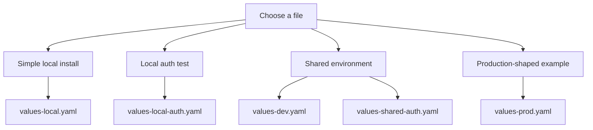

# Example Overlays

This folder contains example values files.

If you are new, think of them as example config files you can learn from or
start from.

## Overlay selection

## Overlay inventory

| File | What it is for |
| --- | --- |
| `values-local.yaml` | The easiest local install |
| `values-local-auth.yaml` | Local install with login and access pieces turned on |
| `values-local-superset.yaml` | Local install focused on Superset |
| `values-local-layers.yaml` | Local install with a richer example layout |
| `values-dev.yaml` | Main shared development example |
| `values-prod.yaml` | Main production-shaped example |
| `values-prod-layers.yaml` | Production-shaped example with extra layering |
| `values-shared-auth.yaml` | Shared example using an external OIDC provider |
| `values-external-s3.yaml` | Example using external S3 |
| `values-minio.yaml` | Example focused on MinIO |

## Validation expectations

- every file in this folder is part of the repo’s validation story
- `./hack/lint.sh` checks them
- `./hack/template.sh` renders them

Important difference between the two main local examples:

- `values-local.yaml`
  is the easiest manual local install
- `values-local-auth.yaml`
  is the auth-enabled local test and is normally run through
  `make smoke-install` because that script creates the demo Secrets it needs

## Shared-Environment Expectations

The shared examples are not self-contained.

They expect real environment-specific things such as:

- real hostnames
- real TLS Secrets
- real LDAP credentials
- real OIDC client secrets
- real storage credentials

## Governance Expectation

For non-local datasets, the examples should include a `governance` block under
`global.dataCatalogs.<catalog>.governance`.

That is part of the chart contract.

## Security note

- local examples may contain demo credentials
- non-local examples should not contain real secrets
- external storage examples should point to existing Secrets instead of
  committing credentials into Git

## Maintainer note

Keep these files readable. They are not just test inputs. They are also part of
the user documentation.
