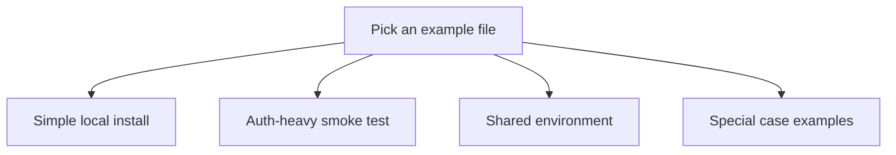

# Example Settings Files

This folder contains example chart settings files.

If the word "values" is new: a values file is the YAML file that tells the
chart what to install and how to configure it.

## Which file should you start with

| File | Plain meaning | Use this when |
| --- | --- | --- |
| `values-local.yaml` | Simplest local install | You want the easiest manual first try. |
| `values-local-auth.yaml` | Auth-heavy local smoke test | You want to test sign-in, browser proxies, and Ranger too. |
| `values-dev.yaml` | Shared development example | You want the main shared development baseline. |
| `values-prod.yaml` | Production-shaped example | You want the main shared production baseline. |
| `values-shared-auth.yaml` | Shared example with an external sign-in provider | You already have an external sign-in provider and do not want bundled Keycloak. |

## Full file list

| File | Plain meaning |
| --- | --- |
| `values-local.yaml` | Simplest local install |
| `values-local-auth.yaml` | Auth-heavy smoke test |
| `values-local-superset.yaml` | Local example focused on Superset |
| `values-local-layers.yaml` | Local example with more layering |
| `values-dev.yaml` | Shared development baseline |
| `values-prod.yaml` | Shared production baseline |
| `values-prod-layers.yaml` | Production-style example with more layering |
| `values-shared-auth.yaml` | Shared example with an external sign-in provider |
| `values-external-s3.yaml` | Example that points at external object storage |
| `values-minio.yaml` | Example focused on MinIO |

## Two important first-timer rules

- `values-local.yaml` is the easiest manual first install.
- `values-local-auth.yaml` is normally run through `make smoke-install`
  because that script creates the demo Secrets that file needs.

## Shared-environment warning

The shared examples are not self-contained.

They usually expect real:

- hostnames
- TLS Secrets
- sign-in client Secrets
- directory-service settings
- storage credentials

## Governed-data warning

For non-local datasets, shared examples should include a
`global.dataCatalogs.<catalog>.governance` block.

That block tells the chart what kind of data it is and whether the access
rules are safe enough for that kind of data.

## When you can ignore this folder

You can ignore this folder only if you never use the source repo and only work
with the already-published chart package.

## Common mistake

Do not guess which local file to use first. Start with `values-local.yaml`
unless you specifically want the auth-heavy smoke path.
