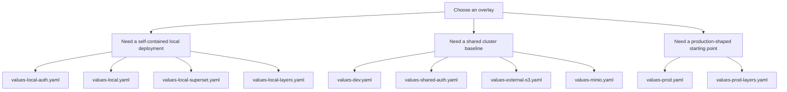

# Example Overlays

This directory contains example values files for local validation, shared
cluster use, and production-shaped baselines.

## Overlay selection

## Overlay inventory

| File | Primary use | Characteristics |
| --- | --- | --- |
| `values-local-auth.yaml` | Local render-oriented Keycloak-local-users example | Bundled Keycloak self-registration, Keycloak-managed app groups, Ranger, portal, CloudBeaver, Prefect proxy, MinIO, Hive, Spark Operator, and local demo secrets |
| `values-local.yaml` | Canonical kind validation path | MinIO, Hive, Prefect, Spark Operator, Vault dev mode, reduced Trino footprint |
| `values-local-superset.yaml` | Focused local BI validation path | MinIO, Trino, and Superset with demo credentials, seeded local Trino datasource, bundled Superset PostgreSQL and Redis |
| `values-local-layers.yaml` | Richer local topology example | Multiple catalogs, layered access patterns, self-contained object storage |
| `values-dev.yaml` | Shared development baseline | Bundled Keycloak, external organizational LDAP/AD, Ranger, portal, CloudBeaver, and Prefect proxy |
| `values-shared-auth.yaml` | Shared external-identity escape hatch | Externally managed OIDC plus LDAP/AD scaffold |
| `values-prod.yaml` | Minimal production-shaped baseline | Bundled Keycloak, external LDAPS, Ranger, portal, CloudBeaver, and Prefect proxy |
| `values-prod-layers.yaml` | Layered production example | Multiple catalogs and production-style access patterns |
| `values-external-s3.yaml` | Simplest external object-storage baseline | External S3 enabled and MinIO disabled |
| `values-minio.yaml` | Isolated MinIO scenario | Enables only the in-cluster object-store path |

## Validation expectations

- `./hack/lint.sh` lints the umbrella chart against every file in this
  directory.
- `./hack/template.sh` renders the umbrella chart against every file in this
  directory.
- `values-local.yaml` is the canonical local smoke-install proof point.
- `values-local-auth.yaml` is the render-oriented example for the
  `keycloakLocal` identity mode.
- `values-local-superset.yaml` is the focused local proof point for the
  optional Superset integration.
- `values-dev.yaml` and `values-prod.yaml` are the primary shared-environment
  examples for the default Keycloak plus LDAP/AD plus Ranger model, including
  the portal and CloudBeaver browser entry story.
- `values-local-auth.yaml` shows the first-class non-LDAP `keycloakLocal`
  path: self-registration in Keycloak, no default app access, Ranger kept as
  the Trino authorization plane, and OIDC/token-capable Trino clients.
- The shared-environment examples now treat
  `global.authorization.platformRoles` as the long-lived access baseline and
  use the current `platform-admin`, `data-analyst`, and
  `principal-investigator` role pattern with role-based Ranger bootstrap
  policies instead of raw group policies.
- `values-shared-auth.yaml` is the render-validated escape hatch for an
  externally managed OIDC provider.

## Shared-auth Overlay Expectations

- `values-shared-auth.yaml` assumes real ingress hosts, DNS, and externally
  created Kubernetes Secrets for OIDC clients, object-store credentials,
  proxy credentials, and LDAP bind credentials.
- It uses the same `global.identity` and `global.authorization` contract as the
  bundled-Keycloak examples, but points the OIDC issuer at an external IdP.
- Treat it as a pattern for shared environments, then copy and tailor it in a
  consumer repository or environment-specific values file.

## Governance Expectation

Every non-local catalog example now includes a `governance` block. That is not
decorative. It is part of the supported chart contract and is validated during
`helm lint` and `helm template`.

## Security note

- `values-local.yaml`, `values-local-superset.yaml`, and
  `values-local-layers.yaml`, and `values-local-auth.yaml` are disposable local
  overlays and intentionally contain demo credentials for self-contained kind
  validation.
- Non-local overlays in this directory should remain free of inline
  credentials.
- External S3 overlays should point at an existing Kubernetes Secret for
  object-store credentials rather than carrying placeholder access keys in
  versioned values files.

## Maintainer note

Keep example overlays readable. They are part of the handover and consumer
story, not just test inputs.

Shared-environment examples should also stay organization-neutral. They may
demonstrate the reusable `platformHome` contract, but institution-specific
branding such as logos, fonts, and color systems belongs in downstream
consumer overlays rather than in the chart defaults.
