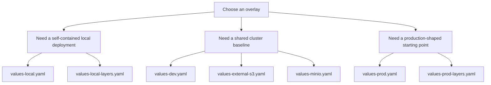

# Example Overlays

This directory contains example values files for local validation, shared
cluster use, and production-shaped baselines.

## Overlay selection

## Overlay inventory

| File | Primary use | Characteristics |
| --- | --- | --- |
| `values-local.yaml` | Canonical kind validation path | MinIO, Hive, Prefect, Spark Operator, Vault dev mode, reduced Trino footprint |
| `values-local-layers.yaml` | Richer local topology example | Multiple catalogs, layered access patterns, self-contained object storage |
| `values-dev.yaml` | Shared development baseline | External S3, lighter worker setup, no Hive by default |
| `values-prod.yaml` | Minimal production-shaped baseline | External S3, scaled workers, MinIO disabled |
| `values-prod-layers.yaml` | Layered production example | Multiple catalogs and production-style access patterns |
| `values-external-s3.yaml` | Simplest external object-storage baseline | External S3 enabled and MinIO disabled |
| `values-minio.yaml` | Isolated MinIO scenario | Enables only the in-cluster object-store path |

## Validation expectations

- `./hack/lint.sh` lints the umbrella chart against every file in this
  directory.
- `./hack/template.sh` renders the umbrella chart against every file in this
  directory.
- `values-local.yaml` remains the canonical end-to-end deployment proof point.

## Security note

- `values-local.yaml` and `values-local-layers.yaml` are disposable local
  overlays and intentionally contain demo credentials for self-contained kind
  validation.
- Non-local overlays in this directory should remain free of inline
  credentials.

## Maintainer note

Keep example overlays readable. They are part of the handover and consumer
story, not just test inputs.
