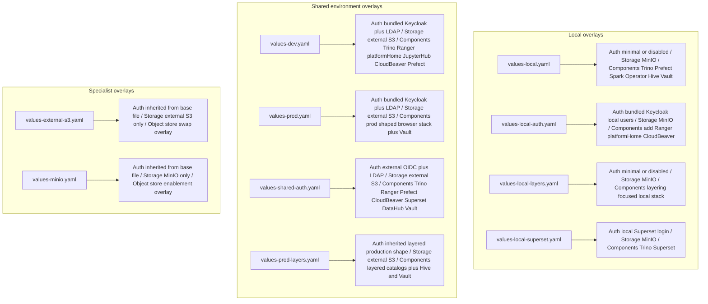

# Example Settings Files

This folder contains example chart settings files.

If the word "values" is new: a values file is the YAML file that tells the
chart what to install and how to configure it.

This folder is not just a bag of samples. It is the quickest way to understand
the install profiles the chart is designed around.

## Who Should Read This

| Reader | Why this guide matters |
| --- | --- |
| first-time deployer | to choose the safest first overlay |
| operator | to understand what an example assumes about secrets, identity, and storage |
| contributor | to know which overlay proves which behavior |
| maintainer | to keep examples aligned with validation and smoke tests |

## How To Read This Folder

The files in this folder fall into two categories:

- full install profiles that are meant to stand on their own
- small overlays that only tweak one part of a larger install shape

The full profiles are the most important starting point. The small overlays are
useful when you already know the base shape you want.

Important rule:

- `values-external-s3.yaml` and `values-minio.yaml` are specialist overlays,
  not standalone installs
- apply them after a full profile such as `values-dev.yaml` or
  `values-shared-auth.yaml`
- if you pass only one of those specialist files to Helm, you will not get a
  complete environment



## Which File Should You Start With

| File | Start here when... | Important caveat |
| --- | --- | --- |
| `values-local.yaml` | you want the easiest manual first install | simpler than the auth-heavy smoke path |
| `values-local-auth.yaml` | you want to test login, proxies, and Ranger locally | normally use `make smoke-install`, not a plain manual install |
| `values-dev.yaml` | you want the main shared development baseline | expects real hostnames, secrets, and directory settings |
| `values-prod.yaml` | you want the main production-shaped baseline | not a turnkey production deployment; still needs real infra inputs |
| `values-shared-auth.yaml` | you already have an external OIDC provider | does not bundle Keycloak |

## How To Compose Specialist Overlays

The two storage overlays are designed to be layered onto a base profile.

Examples:

```bash
helm upgrade --install dlh charts/dlh-in-a-box \
  -n data-lakehouse \
  --create-namespace \
  -f examples/values-dev.yaml \
  -f examples/values-external-s3.yaml
```

```bash
helm upgrade --install dlh charts/dlh-in-a-box \
  -n data-lakehouse-local \
  --create-namespace \
  -f examples/values-local.yaml \
  -f examples/values-minio.yaml
```

Use the full profile first, then layer the specialist override after it so the
override wins where the files overlap.

## Full File Inventory

| File | Type | Main purpose |
| --- | --- | --- |
| `values-local.yaml` | full profile | smallest local platform install |
| `values-local-auth.yaml` | full profile | local auth-heavy smoke profile |
| `values-local-layers.yaml` | full profile | local layered catalog profile |
| `values-local-superset.yaml` | full profile | local Superset-focused profile |
| `values-dev.yaml` | full profile | shared development baseline |
| `values-prod.yaml` | full profile | production-shaped shared baseline |
| `values-prod-layers.yaml` | full profile | production-shaped layered governance example |
| `values-shared-auth.yaml` | full profile | shared profile that consumes an external IdP |
| `values-external-s3.yaml` | specialist overlay | switches storage to an external S3-compatible backend |
| `values-minio.yaml` | specialist overlay | enables MinIO-backed storage using an existing Secret |

## Global Rules For This Folder

- local overlays intentionally contain fake demo credentials in a few places
  because they are meant for disposable local clusters
- non-local overlays are expected to stay free of inline secrets
- shared examples are not self-contained; they expect real DNS, TLS, secrets,
  and identity inputs
- if you change validation rules, you usually need to update at least one
  example overlay and possibly render-contract fixtures too

## Narrative Install Profiles

### `values-local.yaml`

Purpose:

- prove the chart can install a compact local data platform
- give newcomers one true first-success path

Auth model:

- no shared identity contract
- no bundled Keycloak
- no browser auth proxies

Storage model:

- MinIO is enabled
- Hive and Trino point at the same local bucket

Main components enabled:

- Trino
- Prefect server and worker
- Spark Operator
- MinIO
- Hive Metastore and Hive PostgreSQL
- Vault in dev mode

What it tests:

- core local rendering
- Trino plus Hive plus MinIO wiring
- basic Prefect local setup

What it deliberately does not test:

- Keycloak
- Ranger
- `platformHome`
- CloudBeaver
- browser login flows

Use this when:

- you want the fastest path to a working local release
- you are debugging non-auth platform wiring

### `values-local-auth.yaml`

Purpose:

- exercise the chart's local browser-auth and access-control story
- serve as the smoke-test overlay

Auth model:

- `bundledKeycloak`
- `keycloakLocal`
- OIDC clients for Trino, `platformHome`, CloudBeaver proxy, Prefect proxy,
  and Trino direct grant

Storage model:

- MinIO

Main components enabled:

- everything from the simpler local stack
- Keycloak
- Ranger
- `platformHome`
- CloudBeaver plus auth proxy
- Prefect plus auth proxy

What it tests:

- Keycloak realm bootstrap
- oauth2-proxy front doors
- Ranger policy bootstrap
- local-user sync behavior
- `platformHome` auth wiring

Required inputs:

- normally none from the user, because `scripts/helm/smoke-install.sh` seeds the demo
  secrets for this file

What it omits:

- shared LDAP-backed auth
- external OIDC
- production-grade secrets and TLS

Use this when:

- you are changing identity, browser auth, Ranger, or the smoke path itself

Do not use this as your first manual install unless you are also creating the
demo Secrets it expects.

### `values-local-layers.yaml`

Purpose:

- demonstrate a local multi-catalog stack with bronze, silver, gold, and
  geospatial examples

Auth model:

- no shared identity contract

Storage model:

- MinIO

Main components enabled:

- Trino
- Prefect
- Spark Operator
- MinIO
- Hive
- Vault

What it tests:

- multiple catalog definitions
- mixed Delta Lake and Hive catalog examples
- local lakehouse layering concepts

What it omits:

- Keycloak
- Ranger
- browser auth layers

Use this when:

- you want to test catalog iteration or layered datasets locally

### `values-local-superset.yaml`

Purpose:

- prove a focused local Superset shape without the rest of the shared browser
  stack

Auth model:

- local Superset admin bootstrap, not the shared OIDC browser pattern

Storage model:

- MinIO

Main components enabled:

- Trino
- Superset
- MinIO

Main components disabled:

- Prefect
- Spark Operator
- Hive
- DataHub
- Vault

What it tests:

- Superset packaging
- Superset metadata DB and Redis dependencies
- a preloaded Trino datasource

Use this when:

- you are working specifically on the optional Superset integration

### `values-dev.yaml`

Purpose:

- document the main shared development baseline

Auth model:

- `bundledKeycloak`
- `externalLdap`
- OIDC clients for Trino, Trino direct grant, `platformHome`, JupyterHub,
  CloudBeaver proxy, and Prefect proxy

Storage model:

- `externalS3`

Main components enabled:

- Trino
- Ranger
- Prefect plus auth proxy
- `platformHome`
- JupyterHub
- CloudBeaver plus auth proxy
- Keycloak

Main components disabled by default here:

- DataHub
- Superset

What it tests:

- the repo's primary shared-development auth pattern
- LDAP-backed group sync
- external object storage wiring
- governed catalog configuration

Required external inputs:

- TLS secrets
- OIDC client secret material
- LDAP bind secret
- object-store credentials
- Ranger and Keycloak admin secrets

Use this when:

- you want the reference shared dev shape

### `values-prod.yaml`

Purpose:

- document the production-shaped baseline that still stays safe to publish

Auth model:

- bundled Keycloak plus LDAP or AD federation

Storage model:

- external S3

Main components enabled:

- Trino
- Ranger
- Prefect plus auth proxy
- `platformHome`
- JupyterHub
- CloudBeaver plus auth proxy
- Keycloak
- Vault

Main components disabled by default here:

- Superset
- DataHub
- MinIO
- Hive

What it tests:

- the production-shaped browser stack
- external object-store assumptions
- stricter shared-environment examples

Required external inputs:

- everything the dev overlay needs, plus production-grade AD or LDAP settings
  and browser-facing DNS/TLS inputs

Use this when:

- you want the main production-shaped reference, not a turnkey production
  deployment

### `values-prod-layers.yaml`

Purpose:

- show a more explicit multi-catalog governance example for a prod-shaped
  environment

Auth model:

- inherits the production-style governance pattern, not the local auth story

Storage model:

- external S3

Main components enabled:

- Ranger
- Hive
- Vault

Main behavior emphasized:

- multiple platform roles
- multiple Ranger bootstrap policies
- multiple governed catalogs with explicit metadata

What it tests:

- how layered catalogs and governance blocks scale beyond one dataset

Use this when:

- you are working on governance or layered access examples, not on the simplest
  install path

### `values-shared-auth.yaml`

Purpose:

- document the escape-hatch shared pattern where the organization already owns
  the OIDC provider

Auth model:

- `externalOidc`
- `externalLdap`

Storage model:

- external S3

Main components enabled:

- Trino
- Ranger
- Prefect plus auth proxy
- CloudBeaver plus auth proxy
- Superset
- DataHub
- Vault

Main components disabled:

- bundled Keycloak
- MinIO
- Hive

What it tests:

- external IdP integration
- DataHub OIDC wiring
- Superset OIDC wiring
- shared browser proxy patterns without bundled Keycloak

Use this when:

- you already have an identity provider and want the chart to integrate with it

### `values-external-s3.yaml`

Purpose:

- switch storage to an external S3-compatible backend

This file is a narrow overlay, not a full install profile.

What it changes:

- `global.storage.backend`
- external S3 endpoint, region, bucket, and credential secret
- disables MinIO

Use this when:

- you want to layer external object storage on top of another example

### `values-minio.yaml`

Purpose:

- switch storage to MinIO using an existing Secret

This file is also a narrow overlay, not a full install profile.

What it changes:

- `global.storage.backend=minio`
- MinIO root credential secret wiring
- MinIO bucket creation

It also keeps DataHub and Hive disabled because this overlay is about storage
enablement, not a full platform profile.

## Required Secrets And Inputs By Example Class

| Example class | Usually expects user-provided secrets? | Notes |
| --- | --- | --- |
| local minimal overlays | no, or only fake inline local credentials | disposable local demos |
| local auth smoke overlay | not when run through `make smoke-install` | the smoke script seeds demo secrets |
| shared dev or prod overlays | yes | real hostnames, TLS, directory, OIDC, and storage inputs required |
| specialist storage overlays | yes, if layered onto shared profiles | they assume you already know the base install context |

## How This Folder Connects To The Rest Of The Repo

- `scripts/helm/template.sh` renders the chart against every example file unless you
  pass a smaller list
- `scripts/lint.sh` lints the chart against every example file
- `scripts/helm/smoke-install.sh` uses `values-local-auth.yaml`
- `test/render-contract.sh` uses the shared and local auth baselines as inputs
  for many negative tests

When an example changes, you should ask:

- is this meant to be a supported install shape or just a convenience overlay
- which maintainer script depends on this file
- does this change require matching validation updates

## How To Validate Changes

For example changes, the normal validation path is:

```bash
./scripts/lint.sh
./scripts/template.sh
```

If you changed `values-local-auth.yaml` or anything identity-related, also run:

```bash
make smoke-install
```

If you changed validation rules that examples are supposed to satisfy, also run:

```bash
./scripts/render-contract.sh
```

## Common Mistakes

- treating every file here as a complete standalone install
- using `values-local-auth.yaml` manually without its demo secrets
- copying shared examples into real environments without replacing placeholders
- putting real credentials into non-local examples
- forgetting that the shared examples are documentation of supported patterns,
  not production automation by themselves

## When You Can Ignore This Folder

You can ignore this folder only if you are neither installing from source nor
changing example behavior.

For nearly everyone else, this folder is the fastest way to understand what the
chart is supposed to do in practice.
