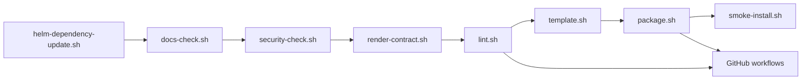

# Maintainer Scripts

This directory contains the repeatable local scripts used to validate, render,
package, and smoke-test the chart.

They are meant to mirror CI and release expectations, not invent a separate
maintainer-only workflow.

Audience: repository collaborators who need the local validation and smoke
install tools.

What you will learn: which script does what, which sequence matches CI, and
when the auth-enabled smoke path is the right extra check.

Read next: [../CONTRIBUTING.md](../CONTRIBUTING.md) for the overall workflow,
or [../docs/release-playbook.md](../docs/release-playbook.md) for release
steps.

## Script flow



## Script inventory

| Script | Purpose |
| --- | --- |
| `docs-check.sh` | Verify guide coverage, local links, required headings, wording guardrails, and Mermaid diagrams |
| `helm-dependency-update.sh` | Refresh `Chart.lock` and packaged dependency archives |
| `license-check.sh` | Verify required notice files and local vendor modification markers |
| `render-contract.sh` | Prove supported positive renders and expected negative validation failures |
| `security-check.sh` | Guard against inline credentials, mutable workflow refs, and secret-bearing ConfigMaps |
| `lint.sh` | Run docs, license, security, render-contract, schema, and Helm lint checks |
| `template.sh` | Render the chart against all tracked example overlays or a supplied subset |
| `package.sh` | Package the chart into `dist/`, with optional version overrides |
| `smoke-install.sh` | Seed demo Secrets, install `examples/values-local-auth.yaml`, wait for readiness, and collect diagnostics on failure |

## Typical maintainer sequence

```bash
./hack/helm-dependency-update.sh
SKIP_MERMAID_CHECK=1 ./hack/docs-check.sh
./hack/render-contract.sh
./hack/lint.sh
./hack/template.sh
./hack/package.sh
./hack/smoke-install.sh
```

Equivalent convenience targets are available through `make` at the repository
root.

Use `./hack/smoke-install.sh` when you need the auth-enabled smoke path. That
script is the supported way to install `examples/values-local-auth.yaml`
because it seeds the demo Secrets that overlay expects.

## Docker note

`docs-check.sh` uses Docker-backed Mermaid rendering for full local diagram
validation. If Docker is not available locally, use
`SKIP_MERMAID_CHECK=1 ./hack/docs-check.sh` as the deliberate bypass. CI still
runs the full check in an environment where Docker is available.

## Maintainer note

Keep these scripts aligned with:

- the example overlays in `examples/`
- the documentation in `README.md` and `docs/`
- the workflows in `.github/workflows/`

If those three views drift apart, new users and maintainers get different
answers from the same repository.
