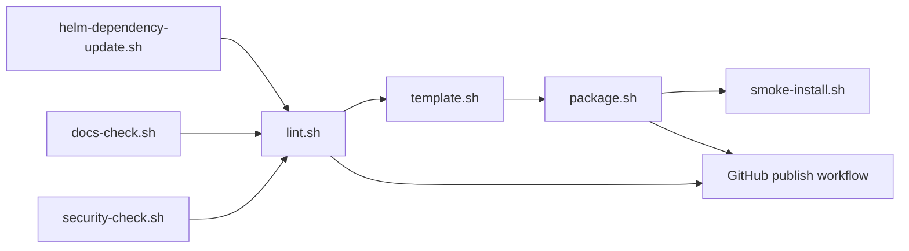

# Maintainer Scripts

This directory contains the repeatable local scripts used for dependency
refresh, validation, packaging, and release preparation.

## Script flow



## Script inventory

| Script | Purpose |
| --- | --- |
| `docs-check.sh` | Verify that maintained directories still carry local guide files |
| `helm-dependency-update.sh` | Refresh `Chart.lock` and packaged dependencies |
| `license-check.sh` | Verify required notice files and local vendor modification markers |
| `security-check.sh` | Guard against secret-bearing ConfigMaps, mutable workflow action refs, and inline credentials in non-local example overlays |
| `lint.sh` | Run docs, script, schema, license, security, and Helm lint checks against every example overlay |
| `template.sh` | Render the chart against every example overlay or a supplied subset |
| `package.sh` | Package the chart, optionally overriding chart and app versions |
| `smoke-install.sh` | Install the validated local overlay into a cluster, wait for workloads, and collect diagnostics on failure |

## Typical maintainer sequence

```bash
./hack/helm-dependency-update.sh
./hack/lint.sh
./hack/template.sh
./hack/package.sh
./hack/smoke-install.sh
```

Equivalent convenience targets are also available through `make` at the
repository root.

## Maintainer note

Keep these scripts aligned with GitHub Actions. They are meant to be the local
mirror of what CI and publication automation expect, not a separate workflow.
