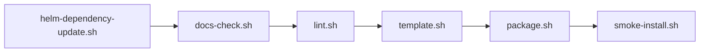

# Maintainer Scripts

This folder contains the local scripts that check, render, package, and test
the chart.



## What is in this folder

| Script | Plain meaning |
| --- | --- |
| `helm-dependency-update.sh` | Refresh chart dependencies and `Chart.lock` |
| `docs-check.sh` | Check local guide files, links, and Mermaid diagrams |
| `license-check.sh` | Check bundled license and notice files |
| `security-check.sh` | Check for a few risky patterns |
| `render-contract.sh` | Check that good small test files still work and bad ones still fail |
| `lint.sh` | Run the main local validation path |
| `template.sh` | Render the chart with the tracked example files |
| `package.sh` | Build the chart package |
| `smoke-install.sh` | Run the auth-heavy local smoke install |
| `testdata/` | Small fake input files used by some of the scripts |

## The main local check path

Run:

```bash
./hack/helm-dependency-update.sh
SKIP_MERMAID_CHECK=1 ./hack/docs-check.sh
./hack/lint.sh
./hack/template.sh
./hack/package.sh
```

If you also changed sign-in, access rules, or the auth-heavy local example,
run:

```bash
make smoke-install
```

## The smoke-install path

The smoke-install path uses `examples/values-local-auth.yaml`.

That file needs demo Secrets, so the script creates them for you.

This is why `make smoke-install` is the normal way to test that file.

## Docker note

Full Mermaid checking needs Docker.

If Docker is not running, use:

```bash
SKIP_MERMAID_CHECK=1 ./hack/docs-check.sh
```

## When you can ignore this folder

You can ignore this folder if you only use the chart and never maintain the
repo.

## Common mistake

Do not treat the smoke-install path as the same thing as the simplest local
manual install. They test different paths.
