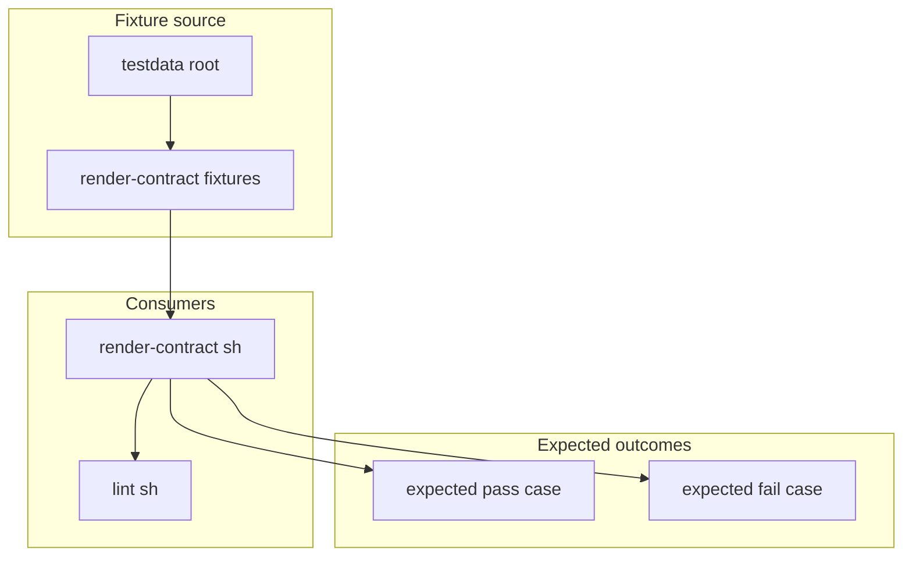

# Script Test Data

This folder contains small fake input files used by maintainer scripts.

They are intentionally not full deployments. Their job is to isolate one rule
or one render contract at a time.

## Who Should Read This

| Reader | Why this guide matters |
| --- | --- |
| contributor | to know where to add tiny focused fixtures instead of bloating the real example overlays |
| maintainer | to understand how script-level contract tests are fed |



## What Lives In This Folder

| Path | Ownership | What it is for |
| --- | --- | --- |
| `render-contract/` | repo-owned fixtures | tiny YAML overlays used by `hack/render-contract.sh` |
| `README.md` | repo-owned guide | this folder manual |

## Fixture Philosophy

These fixtures are designed around one rule:

- one small input
- one focused behavior
- one easy-to-understand expected outcome

That matters because the repo already has full example overlays under
`examples/`. The fixtures here exist so validation logic can be tested without
turning every edge case into a giant environment file.

## How This Folder Fits Into Validation

`hack/render-contract.sh` takes:

- a known-good baseline example from `examples/`
- one focused overlay from this folder

It then checks either:

- that the render succeeds and contains the expected strings
- or that the render fails with the expected message

`hack/lint.sh` includes that render-contract script, so these fixtures are part
of the normal repo validation path.

## Common Tasks

If you need to:

- add a new validation regression case: add a tiny fixture under
  `render-contract/`
- test a new allowed configuration: add a focused expected-pass overlay
- test a new forbidden configuration: add a focused expected-fail overlay

Do not add a full environment here when a three-line overlay would prove the
point.

## Validation

After changing files in this folder, run:

```bash
./hack/render-contract.sh
./hack/lint.sh
```

## Common Mistakes

- copying a whole example values file into this folder
- testing several unrelated rules in one fixture
- adding a fixture file but forgetting to wire it into `hack/render-contract.sh`

## When You Can Ignore This Folder

You can ignore this folder unless you are changing script-driven validation or
adding a regression test.
