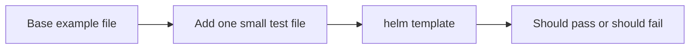

# Render-Check Test Files

This folder contains small YAML files used by `hack/render-contract.sh`.

Each file is meant to prove one rule.

## What is in this folder

| Group | Plain meaning |
| --- | --- |
| `missing-*` files | Cases that should fail because something required is missing |
| `prefect-*` files | Cases that test Prefect sign-in and token rules |
| `cloudbeaver-*` files | Cases that test CloudBeaver sign-in wiring |
| `keycloak-*` files | Cases that test Keycloak-local rules |
| `bootstrap-*` files | Cases that test bootstrap-user and password-auth rules |
| `legacy-*` files | Old keys or old patterns that should no longer be accepted |
| `exception-*` files | Cases that test exception-role metadata |

## How to think about these files

- some files are supposed to pass
- some files are supposed to fail
- each file should stay small
- each file should prove one thing, not many things at once

## When you can ignore this folder

You can ignore this folder unless you are changing validation behavior.

## Common mistake

Do not add a large example here when a tiny one-purpose test file will do.
