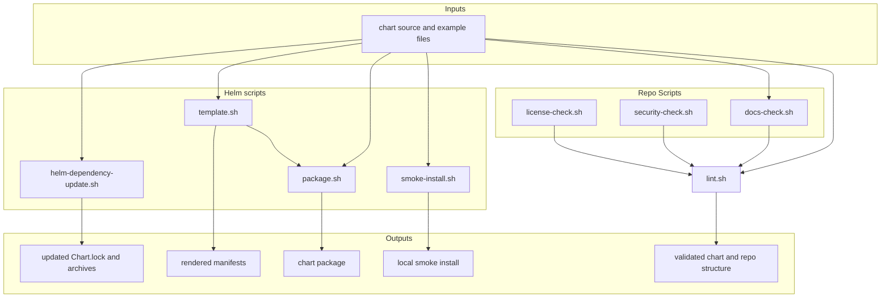

# Maintainer Scripts

This folder contains the local scripts that check, render, package, and test
the chart.



## What Lives In This Folder

| Path    | Purpose                                |
|---------|----------------------------------------|
| `helm/` | Helper scripts that wrap helm commands |
| `repo/` | Scripts to validate repo structure and standards |

## How The Scripts Fit Together

The scripts are divided into two subdirectories, joined by `verify.sh`

`helm/` is for scripts that wrap helm commands, such as helm package or helm lint.
`repo/` is for scripts that enforce repo structure and policies, for example presence and contents
of repo guide files, and presence of required license files.

## Script Behaviour
See the guide files for subdirectories of scripts for documentation on individual maintainer scripts.

### `verify.sh`

What it does:

- runs `repo/license-check.sh`
- runs `repo/docs-check.sh`
- runs `repo/security-check.sh`
- runs `../test/render-contract.sh`
- syntax-checks shell scripts
- parses `values.schema.json`
- runs `helm lint` for the chart alone and then against every example overlay

This is the main local validation entrypoint mirrored by CI.

## Pre-Commit Hooks
Some of these maintainer scripts are used as Git pre-commit hooks. On each commit, this repo's pre-commit hooks will:
- Validate syntax across maintainer scripts
- Run `repo/license-check.sh`
- Run `helm/helm-dependency-update.sh` only if `Chart.yaml` or `Chart.lock` changed
- Run `repo/docs-check.sh`
- Validate Mermaid diagrams only if `*.md` files changed
- Run `helm/helm-lint.sh`
- Run `repo/security-check.sh`
- Run `helm/template.sh`
- Run `shellcheck` on all shell scripts

To use the hooks, ensure pre-commit is installed. Use a system-wide install via brew or another package manager of choice,
or install `pre-commit` to a local python venv.

To activate the hooks:
```commandline
pre-commit install
```
To run the hooks at any point, use `pre-commit` to run on staged files, or `pre-commit run -a` to run on all files.

On first run, these hooks may take a couple of minutes to install and run the helm dependency update and Mermaid validate steps.
Subsequent runs will be much faster, especially if the chart and mermaid diagrams have not changed.
