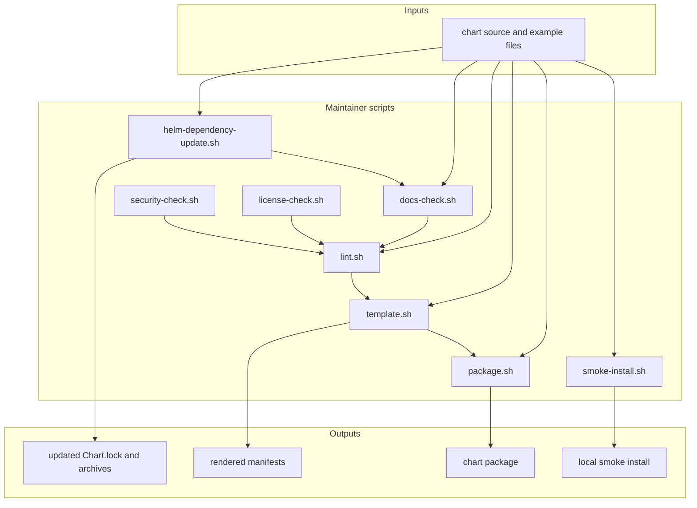

# Maintainer Scripts

This folder contains the local scripts that check, render, package, and test
the chart.

If you are maintaining this repo, this folder is your operational toolbox.

## Who Should Read This

| Reader | Why this guide matters |
| --- | --- |
| contributor | to know which script to run before opening a change |
| maintainer | to understand CI parity, side effects, and failure modes |
| reviewer | to see what local evidence a change should come with |



## What Lives In This Folder

| Script or path | Reads | Writes or side effects | Main job |
| --- | --- | --- | --- |
| `helm/helm-dependency-update.sh` | `Chart.yaml` | updates `Chart.lock` and packaged archives | refresh dependencies |
| `repo/docs-check.sh` | guide files | no repo-tracked writes expected | enforce guide coverage, links, and Mermaid validity |
| `repo/license-check.sh` | `Chart.lock`, notices, vendored licenses, archives | no repo-tracked writes expected | enforce bundled license hygiene |
| `repo/security-check.sh` | workflows, chart templates, examples | no repo-tracked writes expected | catch a few specific risky patterns |
| `lint.sh` | chart, examples, schema, the other scripts | no repo-tracked writes expected | run the main validation path |
| `helm/template.sh` | chart and selected example files | manifests to stdout only | render the chart without installing it |
| `helm/package.sh` | chart source | `dist/*.tgz` | create publishable chart package |
| `helm/smoke-install.sh` | chart, one values file, current kube context | cluster resources, optional diagnostic artifacts | install locally and wait for readiness |
| `repo/validate_mermaid.py` | Markdown guides and Docker | no repo-tracked writes expected | render-check Mermaid blocks through `mermaid-cli` |

## How The Scripts Fit Together

The simplest mental model is:

- `repo/docs-check.sh` protects the guide system
- `repo/license-check.sh` and `repo/security-check.sh` enforce repo hygiene
- `lint.sh` is the main umbrella entrypoint that runs most of the above
- `helm/template.sh` proves the tracked example overlays still render
- `helm/package.sh` proves the chart can still be packaged
- `helm/smoke-install.sh` is the heavy, cluster-touching end-to-end local auth test

## Pre-Commit Hooks
Some of these maintainer scripts are used as Git pre-commit hooks. On each commit, this repo's pre-commit hooks will:
- Validate syntax across maintainer scripts
- Run `repo/license-check.sh`
- Run `helm/helm-dependency-update.sh` only if `Chart.yaml` or `Chart.lock` changed
- Run `repo/docs-check.sh`
- Validate Mermaid diagrams only if `*.md` files changed
- Run `helm/helm-lint.sh`
- Run `repo/security-check.sh`
- Run `helm/template.sh`
- Run `shellcheck` on all shell scripts

To use the hooks, ensure pre-commit is installed. Use a system-wide install via brew or another package manager of choice,
or install `pre-commit` to a local python venv.

To activate the hooks:
```commandline
pre-commit install
```
To run the hooks at any point, use `pre-commit` to run on staged files, or `pre-commit run -a` to run on all files.

On first run, these hooks may take a couple of minutes to install and run the helm dependency update and Mermaid validate steps.
Subsequent runs will be much faster, especially if the chart and mermaid diagrams have not changed.

## Script-By-Script Behavior

### `helm/helm-dependency-update.sh`

What it does:

- runs `helm dependency update` for the umbrella chart
- refreshes `Chart.lock`
- refreshes packaged dependency archives under `charts/dlh-in-a-box/charts/`

Run this when:

- `Chart.yaml` dependency versions changed
- packaged archives and lockfile drifted
- a workflow or packager complains about dependency mismatch

Why it matters:

- the repo stores dependency archives for reproducible packaging
- version changes are incomplete until the lockfile and archives move too

### `repo/docs-check.sh`

What it does:

- ensures important directories still have a local guide file
- checks Markdown fence balance
- checks local Markdown links
- requires every guide file to contain a Mermaid block
- optionally renders Mermaid blocks with Docker via `repo/validate_mermaid.py`

Nuance that is easy to miss:

- a directory can satisfy the guide-file presence check with `README.md`,
  `OVERVIEW.md`, `_README.txt`, or `README.md.gotmpl`
- the Mermaid-diagram requirement is skipped for `.gotmpl` guide files because
  those are template sources rather than rendered local guides

Inputs it cares about:

- `README.md`
- `OVERVIEW.md`
- `_README.txt`
- other Markdown guides covered by the include patterns

Common failure modes:

- a new folder was added without a guide
- a local link target moved
- a Mermaid block is invalid

### `repo/license-check.sh`

What it does:

- checks for required bundled notice and license files
- verifies dependencies in `Chart.lock` are documented in notice files
- enforces modification notices on the locally patched Trino files
- checks the Vault archive still contains its license

Run this when:

- changing dependency versions
- touching notices or provenance files
- refreshing vendored or packaged material

### `repo/security-check.sh`

What it does:

- ensures secret-bearing templates do not accidentally render as ConfigMaps
- ensures important GitHub Actions are pinned to immutable SHAs
- prevents new `bitnamilegacy/` image references from spreading beyond the
  deliberately allowed places
- blocks inline secrets in non-local example overlays

This is not a full security audit. It is a focused set of repo-specific guard
rails.

### `lint.sh`

What it does:

- runs `repo/license-check.sh`
- runs `repo/docs-check.sh`
- runs `repo/security-check.sh`
- runs `../test/render-contract.sh`
- syntax-checks shell scripts
- parses `values.schema.json`
- runs `helm lint` for the chart alone and then against every example overlay

This is the main local validation entrypoint mirrored by CI.

### `helm/template.sh`

What it does:

- runs `helm template` against all example overlays by default
- can also render only the files you pass as arguments

Use this when:

- changing templates
- changing values defaults
- changing example overlays

This is usually the fastest way to prove a change still renders without needing
to install anything.

### `helm/package.sh`

What it does:

- packages the chart into `dist/`
- optionally overrides chart version and app version

Why the optional overrides exist:

- the publish workflow uses them to generate unique prerelease versions for
  pushes to `main`
- tagged releases use the chart version already stored in `Chart.yaml`

Exact argument shape:

- argument 1: chart path, default `charts/dlh-in-a-box`
- argument 2: destination directory, default `dist`
- argument 3: optional chart version override
- argument 4: optional app version override

### `helm/smoke-install.sh`

What it does:

- optionally refreshes dependencies first
- optionally resets the release and namespace
- seeds demo secrets when the target values file is `values-local-auth.yaml`
- installs the chart with `helm upgrade --install`
- waits for Deployments, Jobs, and Pods to become ready
- retries a few common transient Kubernetes API failures
- captures diagnostics into `ARTIFACT_DIR` on failure

Why it is special:

- it is the heaviest local script in this repo
- it talks to a real cluster
- it is the script mirrored by the GitHub Actions smoke workflow

Important environment variables:

- `RELEASE_NAME`
- `NAMESPACE`
- `TIMEOUT`
- `ARTIFACT_DIR`
- `SKIP_DEPENDENCY_UPDATE`
- `RESET_RELEASE_STATE`

What those variables really mean:

- `RESET_RELEASE_STATE=true` uninstalls the release and deletes the namespace
  before reinstalling
- `SKIP_DEPENDENCY_UPDATE=true` skips the dependency refresh that normally
  happens first
- `ARTIFACT_DIR` turns on structured diagnostics capture including Helm status,
  rendered manifest, events, pod descriptions, and logs

Local-auth-only side effect:

- when the target file is exactly `values-local-auth.yaml`, the script seeds
  demo secrets such as `dlh-keycloak-admin`, `dlh-keycloak-config-cli-env`,
  `dlh-ranger-admin`, `dlh-cloudbeaver-oauth2-proxy`,
  `dlh-prefect-oauth2-proxy`, and `dlh-cloudbeaver-bootstrap`
- that secret seeding does not happen for the simpler local overlay or the
  shared-environment examples

Use this when:

- identity changed
- Ranger behavior changed
- auth proxies changed
- the local auth overlay changed

### `repo/validate_mermaid.py`

What it does:

- collects Markdown files from include globs
- finds Mermaid code fences
- uses Docker plus `minlag/mermaid-cli` to render them
- fails if a block cannot render

Why it matters:

- `repo/docs-check.sh` relies on this for strict Mermaid verification
- local authors often hit this only when a diagram looks fine as text but is
  invalid for the renderer

Useful knobs from the actual script:

- `SKIP_MERMAID_CHECK=1` skips the renderer step from `repo/docs-check.sh`
- `MERMAID_STRICT=1` requires Mermaid rendering even outside CI
- `MERMAID_CLI_IMAGE` overrides the Docker image, default
  `minlag/mermaid-cli:10.9.1`
- `MERMAID_DOCKER_PROBE_TIMEOUT_SECONDS`,
  `MERMAID_IMAGE_PULL_TIMEOUT_SECONDS`, and
  `MERMAID_RENDER_TIMEOUT_SECONDS` tune timeout behavior

## The Main Local Validation Path

From the repository root:

```bash
./scripts/helm-dependency-update.sh
./scripts/docs-check.sh
./scripts/lint.sh
./scripts/template.sh
./scripts/package.sh
```

If you changed sign-in, access rules, browser proxies, or the local auth
overlay, also run:

```bash
make smoke-install
```

If you want a thin local wrapper without smoke semantics, `make local-install`
exists in the root `Makefile`, but it should not be treated as equivalent to
`smoke-install`.

## CI Parity

The GitHub workflows intentionally mirror these scripts instead of re-encoding
the logic in YAML.

Closest matches:

- `.github/workflows/helm-lint.yaml` mirrors `deps`, `lint`, `template`, and
  `package`
- `.github/workflows/helm-smoke-install.yaml` mirrors `smoke-install`
- `.github/workflows/helm-publish.yaml` uses `deps`, `lint`, and `package`
  before pushing to GHCR

When a workflow changes, check the matching script here first. The repo expects
local and CI behavior to stay aligned.

## Common Tasks

If you need to:

- prove docs are still structurally valid: run `./hack/docs-check.sh`
- check one example overlay only: run `./hack/template.sh examples/my-file.yaml`
- build a chart package with explicit versions: run
  `./hack/package.sh charts/dlh-in-a-box dist <chart-version> <app-version>`
- debug a failing local auth install: run `make smoke-install` with
  `ARTIFACT_DIR` set so diagnostics are saved

## Common Mistakes

- treating `helm/smoke-install.sh` as equivalent to a simple manual `helm install`
- forgetting that `lint.sh` already runs several other scripts
- changing dependencies without refreshing `Chart.lock` and packaged archives
- debugging auth changes with `values-local.yaml` instead of the smoke path
- adding large real-world YAML examples under `/testdata/`
- assuming local Mermaid validation works without Docker

## When You Can Ignore This Folder

You can ignore this folder only if you are consuming a published chart and do
not intend to validate or maintain the repo locally.

If you are contributing, this folder should become familiar quickly because it
defines what “done” looks like for a change.
