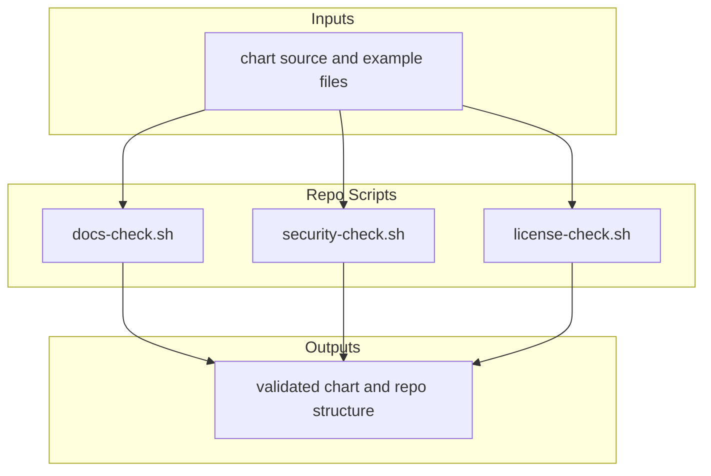

# Repo Scripts

This folder contains the local scripts that validate repo structure and enforce
compliance with repo policies.

## Who Should Read This

| Reader | Why this guide matters |
| --- | --- |
| contributor | to know which script to run before opening a change |
| maintainer | to understand CI parity, side effects, and failure modes |
| reviewer | to see what local evidence a change should come with |

## What Lives In This Folder

| Script or path | Reads | Writes or side effects | Main job |
| --- | --- | --- | --- |
| `docs-check.sh` | guide files | no repo-tracked writes expected | enforce guide coverage, links, and Mermaid validity |
| `license-check.sh` | `Chart.lock`, notices, vendored licenses, archives | no repo-tracked writes expected | enforce bundled license hygiene |
| `security-check.sh` | workflows, chart templates, examples | no repo-tracked writes expected | catch a few specific risky patterns |
| `validate_mermaid.py` | Markdown guides and Docker | no repo-tracked writes expected | render-check Mermaid blocks through `mermaid-cli` |

## How The Scripts Fit Together

The simplest mental model is:

- `docs-check.sh` protects the guide system
- `license-check.sh` and `security-check.sh` enforce repo hygiene

## Script-By-Script Behavior
### `docs-check.sh`

What it does:

- ensures important directories still have a local guide file
- checks Markdown fence balance
- checks local Markdown links
- requires every guide file to contain a Mermaid block
- optionally renders Mermaid blocks with Docker via `repo/validate_mermaid.py`

Nuance that is easy to miss:

- a directory can satisfy the guide-file presence check with `README.md`,
  `OVERVIEW.md`, `_README.txt`, or `README.md.gotmpl`
- the Mermaid-diagram requirement is skipped for `.gotmpl` guide files because
  those are template sources rather than rendered local guides

Inputs it cares about:

- `README.md`
- `OVERVIEW.md`
- `_README.txt`
- other Markdown guides covered by the include patterns

Common failure modes:

- a new folder was added without a guide
- a local link target moved
- a Mermaid block is invalid

### `license-check.sh`

What it does:

- checks for required bundled notice and license files
- verifies dependencies in `Chart.lock` are documented in notice files
- enforces modification notices on the locally patched Trino files
- checks the Vault archive still contains its license

Run this when:

- changing dependency versions
- touching notices or provenance files
- refreshing vendored or packaged material

### `security-check.sh`

What it does:

- ensures secret-bearing templates do not accidentally render as ConfigMaps
- ensures important GitHub Actions are pinned to immutable SHAs
- prevents new `bitnamilegacy/` image references from spreading beyond the
  deliberately allowed places
- blocks inline secrets in non-local example overlays

This is not a full security audit. It is a focused set of repo-specific guard
rails.

### `validate_mermaid.py`

What it does:

- collects Markdown files from include globs
- finds Mermaid code fences
- uses Docker plus `minlag/mermaid-cli` to render them
- fails if a block cannot render

Why it matters:

- `docs-check.sh` relies on this for strict Mermaid verification
- local authors often hit this only when a diagram looks fine as text but is
  invalid for the renderer

Useful knobs from the actual script:

- `SKIP_MERMAID_CHECK=1` skips the renderer step from `repo/docs-check.sh`
- `MERMAID_STRICT=1` requires Mermaid rendering even outside CI
- `MERMAID_CLI_IMAGE` overrides the Docker image, default
  `minlag/mermaid-cli:10.9.1`
- `MERMAID_DOCKER_PROBE_TIMEOUT_SECONDS`,
  `MERMAID_IMAGE_PULL_TIMEOUT_SECONDS`, and
  `MERMAID_RENDER_TIMEOUT_SECONDS` tune timeout behavior
