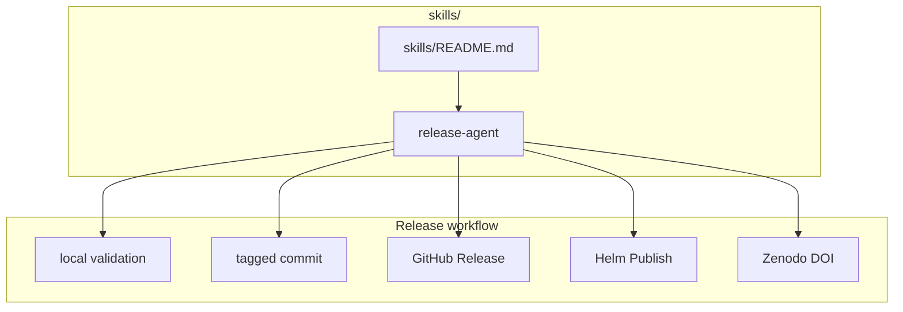

# Maintainer Skills

This folder contains reusable, agent-neutral operating procedures for this
repository.

Use these skills when a maintainer or assistant needs a repeatable workflow
that is more procedural than ordinary documentation.



## What Lives Here

| Path | What it is for |
| --- | --- |
| `README.md` | explains the purpose of the shared skills folder |
| `release-agent/` | tagged Helm chart releases, GitHub Releases, GHCR publishing, Zenodo DOI metadata, and badges |

## Skill Format

Skills in this folder are plain Markdown and intentionally agent-neutral. They
are not tied to Codex, Claude, or any other specific assistant runtime.

Each skill folder should include:

- `README.md` as the folder guide
- `SKILL.md` as the reusable procedure

## Validation

If you add or edit skills, run:

```bash
SKIP_MERMAID_CHECK=1 ./hack/docs-check.sh
```
