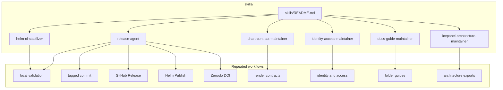

# Maintainer Skills

This folder contains reusable, agent-neutral operating procedures for this
repository.

Use these skills when a maintainer or assistant needs a repeatable workflow
that is more procedural than ordinary documentation.



## What Lives Here

| Path | What it is for |
| --- | --- |
| `README.md` | explains the purpose of the shared skills folder |
| `chart-contract-maintainer/` | chart validation, values schema, render-contract fixtures, and example render coverage |
| `docs-guide-maintainer/` | README-first folder guides, Mermaid blocks, local links, and docs-check behavior |
| `helm-ci-stabilizer/` | Helm Lint, Helm Publish, smoke workflow, dependency-update, and GHCR CI failures |
| `icepanel-architecture-maintainer/` | IcePanel model maintenance, validation, diagram export, and derived architecture artifacts |
| `identity-access-maintainer/` | Keycloak, Ranger, oauth2-proxy, platform-home, app access, and governance access changes |
| `release-agent/` | tagged Helm chart releases, GitHub Releases, GHCR publishing, Zenodo DOI metadata, and badges |

## Skill Format

Skills in this folder are Markdown and intentionally agent-neutral. They are
not tied to Codex, Claude, or any other specific assistant runtime.

Each skill folder should include:

- `README.md` as the folder guide
- `SKILL.md` as the reusable procedure, with optional YAML frontmatter that
  helps agents route to the skill

## Validation

If you add or edit skills, run:

```bash
SKIP_MERMAID_CHECK=1 ./scripts/docs-check.sh
```
