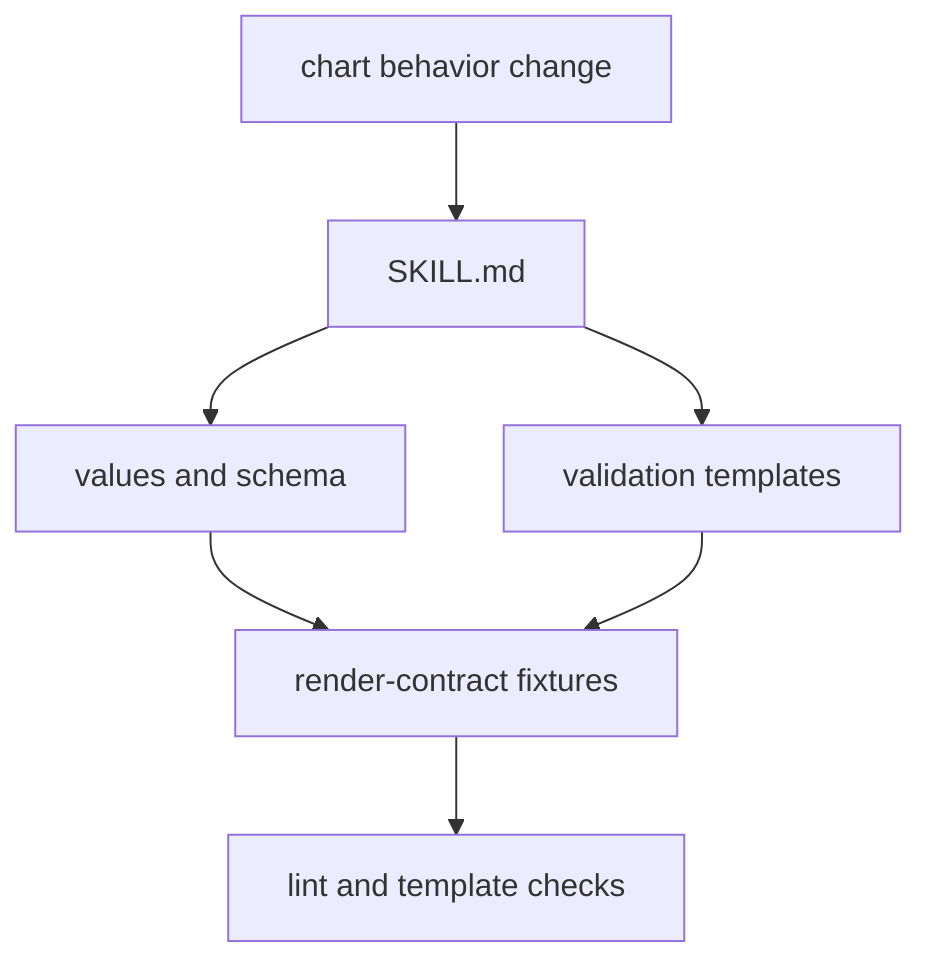

# Chart Contract Maintainer Skill

This skill covers chart validation contracts, values schema, examples, and
render-contract fixtures.

Read [SKILL.md](SKILL.md) when changing chart values, validations, rendered
manifest expectations, or example overlays.

## Files

| Path | What it is for |
| --- | --- |
| `README.md` | this folder guide |
| `SKILL.md` | reusable chart contract maintenance procedure |
